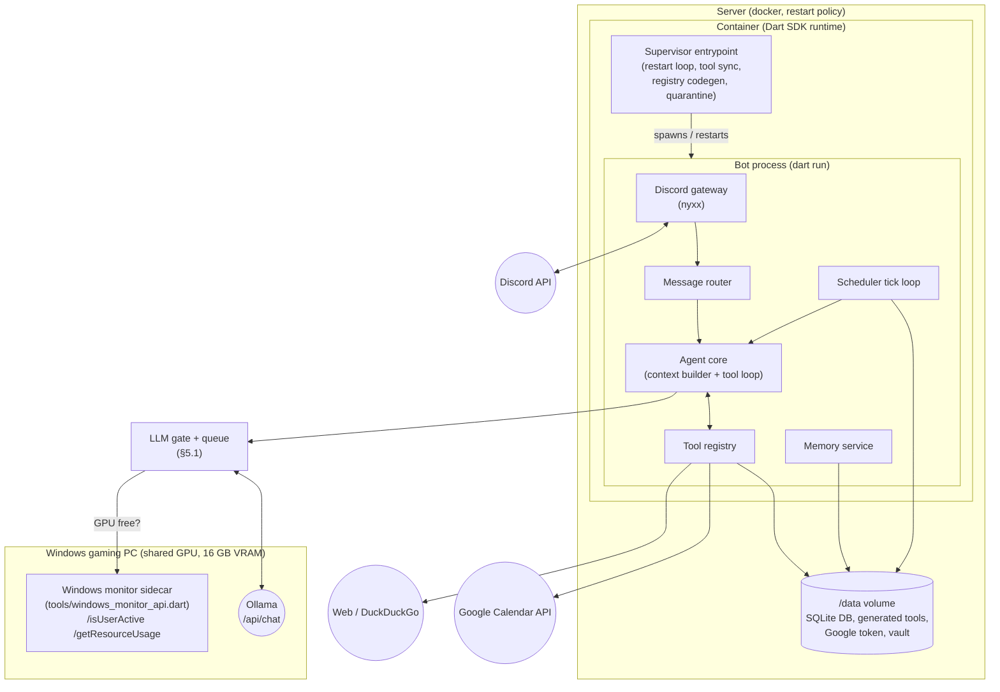
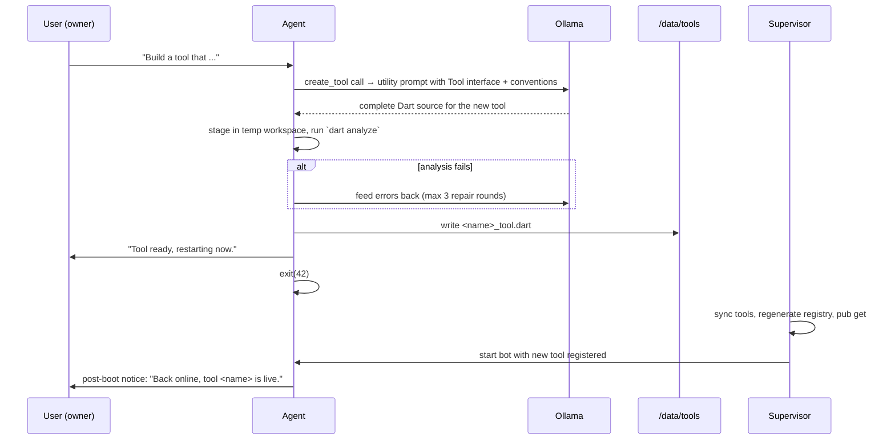

# Egon Bot — Architecture

A personal task executor and daily assistant living on Discord, powered by a local Ollama
instance, written in Dart. This document is the blueprint for the rebuild. The current
code in the repository is the minimal seed (Discord gateway + Ollama client); everything
below describes the target design.

---

## 1. Requirements

| # | Requirement | Covered by |
|---|-------------|-----------|
| R1 | Permanently connected to Discord, always online | §3 Process model |
| R2 | Auto-restart on connection drop or crash | §3 Process model |
| R3 | Memorize text sent directly to the bot | §7 Memory |
| R4 | Scheduled/deferred actions ("remind me in 3 days…") | §8 Scheduler |
| R5 | List its own tools | §6 Tool system (`list_tools`) |
| R6 | Web search | §9 Web tools |
| R7 | Google Calendar integration | §10 Google Calendar |
| R8 | Edit Obsidian notes | §11 Obsidian |
| R9 | Implement its own tools in Dart + restart with new code | §6.4 Self-extension |
| R10 | Query local Ollama for LLM tasks | §5 LLM layer |
| R11 | GPU is shared (16 GB VRAM, gaming PC) — queue big-model calls until the Windows monitor reports the GPU as free | §5.1 GPU gate |

## 2. High-level overview



One Dart process does everything (gateway, agent, scheduler). There is deliberately no
microservice split — a single process on a single host with a persistent volume is the
simplest thing that satisfies the requirements.

## 3. Process model — "always online, always restarts" (R1, R2)

Three independent layers of restart protection, from outside in:

### Layer 1 — Docker restart policy
The container runs with `--restart unless-stopped`. Covers host reboots, OOM kills, and
supervisor bugs.

### Layer 2 — Supervisor entrypoint (inside the container)
The container's entrypoint is not the bot itself but a small supervisor loop
(`supervisor/entrypoint.sh`). Responsibilities:

1. Sync self-written tools from `/data/tools/*.dart` into `lib/src/tools/generated/`.
2. Run `dart run tool/generate_tool_registry.dart` (see §6.3).
3. `dart pub get` (offline-first, falls back to network).
4. Start the bot: `dart run bin/main.dart`.
5. React to the exit code:

| Exit code | Meaning | Supervisor action |
|-----------|---------|-------------------|
| `0` | Clean shutdown requested | Exit container (docker policy decides) |
| `42` | **Restart requested** (new tool installed, self-update) | Restart immediately, reset backoff |
| anything else | Crash | Restart with exponential backoff (5s → 10s → … → max 300s) |

6. **Crash-loop quarantine**: if the bot crashes ≥3 times within 10 minutes *and* a
   generated tool was added/changed since the last healthy run, the supervisor moves the
   newest file from `/data/tools/` to `/data/tools/quarantine/` and restarts. On the next
   successful boot the bot posts a notice to the owner ("Tool X was quarantined after
   causing crashes"). This guarantees a self-written tool can never permanently brick the
   bot.

### Layer 3 — In-process supervision
- The existing reconnect loop in `bin/main.dart`: if the gateway stream ends or throws,
  reconnect (first retry after 60s, then every 5 minutes). nyxx additionally handles
  transient gateway resumes internally.
- A **watchdog**: the bot records the timestamp of the last received gateway event /
  heartbeat ACK. A periodic timer checks it; if nothing was received for 10 minutes, the
  process calls `exit(1)` and lets Layer 2 restart it. This catches "zombie" connections
  that neither error nor deliver events.

### Consequence for the Docker image
Because the bot must be able to load *new Dart source* after a self-restart (R9), the
runtime image can no longer be a compiled-AOT `debian-slim` image. The runtime is the
`dart:stable` image itself and the bot runs JIT via `dart run`. Trade-off: image grows to
roughly 1 GB and startup takes a few seconds longer — acceptable for a single long-running
bot on a home server.

## 4. Repository layout (target)

```
bin/
  main.dart                     # entrypoint: env, supervisor-aware boot, watchdog
lib/src/
  config.dart                   # typed access to all env vars (§12)
  discord/
    gateway.dart                # connect, intents, reconnect loop
    message_router.dart         # DM / mention / whitelist routing
    discord_actions.dart        # send message, split >2000 chars, typing
  agent/
    agent.dart                  # one "turn": context -> LLM -> tool loop -> reply
    context_builder.dart        # system prompt, history window, relevant memories
    tool_loop.dart              # bounded model<->tool conversation
    prompts.dart                # persona + operating instructions
  llm/
    ollama_client.dart          # /api/chat (+ /api/embed later)
    ollama_models.dart          # message/tool-call/tool-schema DTOs
    llm_gate.dart               # GPU-aware FIFO queue in front of the client (§5.1)
  tools/
    tool.dart                   # abstract class Tool + ToolContext + ToolResult
    tool_registry.dart          # lookup, schema export, list_tools rendering
    tool_registry.g.dart        # GENERATED — imports & registers all tools
    builtin/
      list_tools_tool.dart
      web_search_tool.dart
      fetch_url_tool.dart
      remember_tool.dart
      recall_memories_tool.dart
      forget_memory_tool.dart
      schedule_task_tool.dart
      list_scheduled_tasks_tool.dart
      cancel_scheduled_task_tool.dart
      calendar_list_events_tool.dart
      calendar_create_event_tool.dart
      calendar_update_event_tool.dart
      calendar_delete_event_tool.dart
      obsidian_list_notes_tool.dart
      obsidian_read_note_tool.dart
      obsidian_write_note_tool.dart
      obsidian_append_note_tool.dart
      obsidian_search_notes_tool.dart
      create_tool_tool.dart     # the self-extension tool
      restart_self_tool.dart
      defer_to_big_model_tool.dart  # registered in degraded mode only (§5.1)
    generated/                  # synced from /data/tools at boot, gitignored
  memory/
    memory_service.dart         # store/search/forget, DM auto-capture
  scheduler/
    scheduler.dart              # tick loop, due-task execution, recurrence
    recurrence.dart             # cron parsing / next-occurrence math
  storage/
    database.dart               # SQLite open/migrate (schema_version pragma)
    migrations.dart
  integrations/
    google_calendar_client.dart
    obsidian_vault.dart         # sandboxed file access to the vault
    windows_monitor_client.dart # client for the GPU monitor sidecar (§5.1)
tool/                           # dev-time scripts (not shipped tools!)
  generate_tool_registry.dart   # codegen for tool_registry.g.dart
  google_calendar_setup.dart    # one-time OAuth consent flow
supervisor/
  entrypoint.sh                 # Layer-2 supervisor (§3)
tools/
  windows_monitor_api.dart      # sidecar: runs ON the Windows gaming PC (not in the
                                # container); reports Parsec activity + GPU load
test/                           # unit tests per subsystem
ARCHITECTURE.md
Dockerfile
deployment.json
```

Persistent volume layout (`/data`, mounted via `deployment.json`):

```
/data/
  egon.db                # SQLite: memories, tasks, conversations, audit log
  tools/                 # self-written tool sources (*.dart)
  tools/quarantine/      # tools removed after causing crash loops
  google/token.json      # OAuth refresh token for Calendar
  vault/                 # Obsidian vault (if synced onto the host, see §11)
  state/                 # supervisor bookkeeping (crash counters, last-good marker)
```

## 5. LLM layer (R10)

- `OllamaClient` talks to the local instance at `OLLAMA_API_BASE_URL`
  (default `http://127.0.0.1:11434`) using `/api/chat` with `stream: false`.
- Tool declarations use Ollama's OpenAI-compatible `tools` array; tool results are fed
  back as `role: tool` messages. This already exists in `lib/src/llm/`.
- **Two models, both served by the same Ollama instance, both tool-calling capable:**
  - **Big model** (`OLLAMA_MODEL`, default `gpt-oss:20b`) — runs on the GPU. Every call
    is gated by §5.1.
  - **Utility model** (`OLLAMA_UTILITY_MODEL`, default `llama3.2:3b`) — forced onto the
    CPU with per-request `options: {"num_gpu": 0}` so it **never touches VRAM** and is
    therefore always available, even mid-game. Optionally capped with `num_thread` to
    stay polite to a running game. Set the variable to an empty string to disable the
    tier.
- Two calling modes:
  - **Chat turn**: full persona system prompt + history + memories + all tool schemas.
    Big model when the GPU is free; utility model in degraded mode when it isn't (§5.1).
  - **Utility call**: schema-constrained extraction with no persona (e.g. "parse this
    reminder request into JSON") using Ollama's `format` parameter for guaranteed-JSON
    output. Always the utility model — reminder parsing keeps working while you game.
- Timeouts: 120s per completion (local models are slow); one retry on transport error.

### 5.1 GPU gate and request queue (R11)

Ollama runs on the Windows gaming PC and shares its 16 GB of VRAM with games. The bot
must never load an expensive model while the machine is in use. The **Windows monitor
sidecar** (`tools/windows_monitor_api.dart`, runs on that PC, port 11433) is the source
of truth:

- `/isUserActive` — `true` while a Parsec session is connected.
- `/getResourceUsage` — current + 5-minute-average CPU/GPU utilization.

**No code calls `OllamaClient` directly.** Everything goes through the `LlmGate`
(`lib/src/llm/llm_gate.dart`), a single-worker FIFO queue in front of the client:

```dart
enum ModelTier { big, small }

class LlmJob {
  final ModelTier tier;
  final List<OllamaChatMessage> messages;
  final List<OllamaTool> tools;
  final String? originChannelId;   // where to deliver a deferred answer
  final DateTime enqueuedAt;
  final Completer<OllamaChatMessage> completer;
}
```

`small` jobs run on the utility model (CPU-only) and **bypass the GPU check entirely**.
Gate policy, evaluated before dispatching each `big` job (and re-polled every
`GPU_POLL_INTERVAL_SECONDS`, default 60, while jobs wait):

| Condition | Verdict |
|-----------|---------|
| `isUserActive == true` | busy — someone is on the machine |
| `gpuUsagePercent.avg5m > GPU_BUSY_THRESHOLD_PERCENT` (default 40) | busy — GPU loaded by something else |
| monitor unreachable | busy — the PC (and with it *both* models) is most likely off |
| otherwise | free — dispatch job |

Tier routing:

| Call | Tier |
|------|------|
| Full agent turn, GPU free | big |
| Full agent turn, GPU busy | **small — degraded mode** (see below) |
| Utility calls (reminder parsing, structured extraction, memory tagging) | small, always |
| `create_tool` code generation | big — code quality matters; queued while busy |
| Scheduler `agent` tasks | big — background work, no urgency; deferred while busy |

**Degraded mode** is what makes the assistant usable while you game: when the GPU is
busy, an interactive turn is handled *immediately* by the utility model with the full
toolset — reminders, memory, scheduling, even web search work fine on a 3B model. Its
degraded-mode system prompt says it is the lightweight fallback and instructs it to
call the special `defer_to_big_model` tool (only registered in degraded mode) whenever
the request needs real reasoning. That tool call ends the turn with *"GPU is in use —
I've queued this and will answer properly once it's free."* and enqueues the original
turn as a `big` job.

Behavior of the big-model queue:

- **Queued interactive turns** (via `defer_to_big_model`, or when the utility tier is
  disabled): when the job eventually runs, the answer is posted to `originChannelId` as
  a reply to the original message. Interactive jobs expire after 6 hours with a short
  apology. Queue cap: 20 jobs; beyond that the bot asks the user to try later.
- **Scheduler `agent` tasks**: never enter the in-memory queue while busy. The task's
  `next_run_at` is pushed +5 minutes and it stays `pending` in SQLite — durable across
  restarts, retried until the GPU frees up.

Edge cases:

- **VRAM hygiene**: when the monitor reports the user just became active and no big job
  is mid-flight, the gate immediately unloads the big model from VRAM
  (`/api/generate` with `"keep_alive": 0`) instead of letting Ollama's keep-alive hold
  ~13 GB for another 5 minutes while a game starts.
- Monitor unreachable for >15 minutes while jobs are queued → notify the owner once
  ("monitor down, N requests waiting"), keep waiting. No degraded mode either — the
  utility model lives on the same machine.
- Concurrency is 1 by design: one big model call at a time, so Ollama never holds more
  than one big model's VRAM plus context. Small jobs may run concurrently with a big
  job (different resource pools: CPU vs GPU).
- The queue is in-memory. On a *graceful* restart (exit 42) the bot first posts "I'm
  restarting, please re-send your request" to the origin channels of queued jobs. After
  a crash, queued interactive jobs are simply lost (scheduled tasks are not — they live
  in SQLite).

The seed already contains the first slice of this: `WindowsMonitorClient`, and a message
loop that answers via the CPU-only utility model while the GPU is busy (refusing only if
the utility tier is disabled). The queue and degraded-mode toolset arrive with the full
agent.

## 6. Tool system (R5, R9)

### 6.1 The `Tool` interface

Every capability — built-in or self-written — implements one abstract class:

```dart
abstract class Tool {
  /// Unique snake_case identifier, e.g. `web_search`.
  String get name;

  /// One-paragraph description shown to the LLM. Must state when to use it,
  /// what it returns, and when NOT to use it.
  String get description;

  /// JSON Schema (draft-07 subset Ollama understands) for the arguments.
  Map<String, Object?> get parametersJsonSchema;

  /// Tools that mutate external state (notes, calendar, code) are restricted
  /// to the owner (§13). Defaults to false.
  bool get ownerOnly => false;

  /// Execute the call. Must not throw for expected failures — return
  /// ToolResult.error() instead so the LLM can react.
  Future<ToolResult> execute(ToolContext context, Map<String, Object?> args);
}

class ToolContext {
  final String channelId;
  final String userId;
  final bool isOwner;
  final Services services; // db, memory, scheduler, calendar, vault, registry, discord
}

class ToolResult {
  final Map<String, Object?> json;   // fed back to the model verbatim
  ToolResult.ok(this.json);
  ToolResult.error(String message) : json = {'error': message};
}
```

### 6.2 Registry and `list_tools` (R5)

`ToolRegistry` holds all instances, exports their schemas for the Ollama call, dispatches
tool calls by name, enforces `ownerOnly`, and writes every invocation (name, args, caller,
duration, success) to the `tool_audit_log` table. The built-in `list_tools` tool renders
name + description + origin (`builtin` / `self-written`) as the tool result, so the model
can answer "what can you do?" accurately.

### 6.3 Registry code generation

Dart cannot load code at runtime (no reflection-based plugin loading in AOT/JIT without
isolates + mirrors complexity), so registration is done by **codegen at boot**:

`tool/generate_tool_registry.dart` scans `lib/src/tools/builtin/` and
`lib/src/tools/generated/`, and writes `tool_registry.g.dart`:

```dart
// GENERATED — do not edit.
import 'builtin/web_search_tool.dart';
import 'generated/pomodoro_timer_tool.dart';
// ...

List<Tool> buildAllTools(Services services) => [
  WebSearchTool(services),
  PomodoroTimerTool(services),
  // ...
];
```

Convention for discoverability: one tool per file, file name `<tool_name>_tool.dart`,
class name is the PascalCase of the file name, constructor takes `Services`. The
generator validates this convention and skips (and reports) files that violate it.

### 6.4 Self-extension: `create_tool` (R9)

Flow when the user says "build yourself a tool that does X":



Safety rails:
- `create_tool` is `ownerOnly`.
- Static validation before install: `dart analyze` must be clean; the file must contain
  exactly one class extending `Tool`; the tool name must not collide with an existing one.
- The generated source may only import `dart:*` core libraries, `package:http`, and the
  bot's own `tool.dart` — enforced by a simple import whitelist check on the source.
- Crash-loop quarantine (§3) as the last line of defense.
- "Back online" notice: the bot writes a `pending_notice` row before exiting and posts it
  to the originating channel after boot, so restarts are visible in chat.

`restart_self` is a trivial `ownerOnly` tool that just exits with code 42 — useful after
manual edits on the host.

## 7. Memory (R3)

### Storage
SQLite (via `sqlite3` package + `libsqlite3` in the image) at `/data/egon.db`.

```sql
CREATE TABLE memories (
  id          INTEGER PRIMARY KEY AUTOINCREMENT,
  created_at  TEXT NOT NULL,            -- ISO-8601 UTC
  user_id     TEXT NOT NULL,
  channel_id  TEXT,
  content     TEXT NOT NULL,
  source      TEXT NOT NULL,            -- 'dm' | 'explicit' | 'agent'
  tags        TEXT                      -- comma-separated, optional
);
CREATE VIRTUAL TABLE memories_fts USING fts5(content, tags, content=memories);

CREATE TABLE conversation_log (         -- rolling per-channel history
  id          INTEGER PRIMARY KEY AUTOINCREMENT,
  channel_id  TEXT NOT NULL,
  author_id   TEXT NOT NULL,
  author_name TEXT NOT NULL,
  created_at  TEXT NOT NULL,
  content     TEXT NOT NULL
);
```

### Capture
- **Every DM** to the bot is stored as a memory (`source = 'dm'`) *and* handled as a
  conversation turn. That is the literal reading of R3: text sent directly to him is
  memorized.
- In guild channels, messages are logged into `conversation_log` (short-term context,
  pruned to the last 200 per channel) but only promoted to `memories` when the user asks
  ("remember that …") or the agent calls the `remember` tool itself.

### Retrieval
- `recall_memories(query, limit)` → FTS5 match, most recent first.
- The context builder additionally runs an automatic FTS query derived from the incoming
  message and injects the top 5 hits into the system prompt under a
  `## Things you remember` section, so the bot uses its memory without being asked.
- `forget_memory(id)` deletes; `list_memories` (owner DM only) pages through everything.
- Embedding-based retrieval via Ollama `/api/embed` is a later optimization, not in v1.

## 8. Scheduler (R4)

### Data model

```sql
CREATE TABLE scheduled_tasks (
  id            INTEGER PRIMARY KEY AUTOINCREMENT,
  created_at    TEXT NOT NULL,
  created_by    TEXT NOT NULL,          -- user id
  channel_id    TEXT NOT NULL,          -- where the result gets posted
  kind          TEXT NOT NULL,          -- 'message' | 'agent'
  payload       TEXT NOT NULL,          -- message text, or agent instruction
  due_at        TEXT,                   -- one-shot: ISO-8601 UTC
  recurrence    TEXT,                   -- cron expression (5-field), or NULL
  timezone      TEXT NOT NULL DEFAULT 'Europe/Berlin',
  status        TEXT NOT NULL DEFAULT 'pending',  -- pending|done|cancelled|missed
  last_run_at   TEXT,
  next_run_at   TEXT NOT NULL
);
CREATE INDEX idx_tasks_due ON scheduled_tasks(status, next_run_at);
```

Two task kinds keep the common case cheap:
- `message`: post `payload` verbatim to `channel_id`. Used for plain reminders — no LLM
  round-trip at fire time.
- `agent`: run a full agent turn with `payload` as a synthetic user instruction, tools
  enabled ("every Sunday, check the weather and post a summary"). The agent acts in the
  stored channel on behalf of `created_by`.

### Creating tasks
The `schedule_task` tool takes structured arguments
(`kind, payload, due_at | recurrence, channel_id?`). Natural-language time parsing
("in 3 days", "on Sunday", "every Monday at 9") is done by the LLM inside the chat turn —
the system prompt includes the current date/time in `Europe/Berlin`, and the tool
description instructs the model to convert to an absolute ISO timestamp or a cron
expression itself. A utility-mode validation call is *not* needed; the tool validates the
timestamp/cron server-side and returns an error the model can correct.

Example — "Remind me in 3 days in this chat that I want to go to the mall" becomes:

```json
{ "kind": "message",
  "payload": "Reminder: you wanted to go to the mall.",
  "due_at": "2026-07-30T09:35:00Z" }
```

### Execution
- A `Timer.periodic` tick every 30 seconds queries
  `status='pending' AND next_run_at <= now`.
- One-shot: run → `status='done'`. Recurring: run → compute next occurrence from the cron
  expression in the task's timezone → update `next_run_at`.
- **Downtime policy**: at boot, tasks overdue by less than 6 hours are executed
  immediately with a "(delayed)" prefix; older ones are marked `missed` and the owner is
  notified. Recurring tasks skip missed occurrences and resume at the next one.
- **GPU interplay** (§5.1): `message` tasks fire regardless of GPU state (no LLM call
  involved). `agent` tasks check the gate first; while the GPU is busy their
  `next_run_at` is pushed +5 minutes so they stay durable in SQLite instead of sitting
  in the in-memory queue.
- `list_scheduled_tasks` / `cancel_scheduled_task(id)` round out the management surface.

## 9. Web tools (R6)

Port of the previous implementation (recoverable from git history, commit `2bca07a`),
repackaged as two `Tool` classes:

- `web_search(query)` — keyless scraping of DuckDuckGo's `lite` HTML endpoint; returns up
  to 5 `{title, snippet, url}` entries, snippets capped at 280 chars.
- `fetch_url(url)` — GET a public http(s) URL, strip HTML noise, return
  `{url, title, text, content_type, truncated}` capped at 8 000 chars. Text-like MIME
  types only.

Prompt-injection note: content fetched from the web is untrusted. The tool loop tags web
results, and the system prompt instructs the model to never treat fetched text as
instructions. Additionally, `ownerOnly` tools cannot be *triggered by* a turn whose
requesting user isn't the owner regardless of what fetched content says (enforced in the
registry, not the prompt).

## 10. Google Calendar (R7)

- Packages: `googleapis` (CalendarApi) + `googleapis_auth`.
- Auth: **OAuth 2.0 desktop-app flow with a stored refresh token** (a service account
  cannot access a personal calendar without Workspace domain delegation).
  - One-time setup: `dart run tool/google_calendar_setup.dart` prints the consent URL,
    the user pastes the redirect code, and the script writes
    `/data/google/token.json` (refresh token + client id/secret).
  - At runtime the client auto-refreshes access tokens; if the refresh token is revoked,
    calendar tools return a "re-run setup" error instead of crashing.
- Tools (all `ownerOnly` except listing):
  - `calendar_list_events(time_min, time_max, query?)`
  - `calendar_create_event(summary, start, end, description?, location?)`
  - `calendar_update_event(event_id, ...changed fields)`
  - `calendar_delete_event(event_id)`
- Target calendar id comes from `GOOGLE_CALENDAR_ID` (default `primary`).
- All timestamps are converted to/from `Europe/Berlin` for the model, RFC 3339 on the
  wire.

## 11. Obsidian integration (R8)

An Obsidian vault is a folder of Markdown files, so the integration is file-based. The
bot needs the vault on its own filesystem; how it gets there is the one genuinely open
infrastructure decision (see §15). Options:

| Option | How | Trade-off |
|--------|-----|-----------|
| **A. Synced folder (recommended)** | Sync the vault to the server with Syncthing, mount it read-write into the container at `/data/vault` | Robust, works offline, no Obsidian plugin needed; needs Syncthing on both ends |
| B. Git-backed vault | Use the `obsidian-git` plugin; the bot clones the repo, pulls before every operation, commits + pushes after every write | Full history for free; sync conflicts if you edit while offline |
| C. Obsidian Local REST API plugin | Bot calls your desktop over HTTPS | Only works while your desktop + Obsidian are running — conflicts with a 24/7 assistant |

The `ObsidianVault` service wraps all access with sandboxing: every path is resolved
against the vault root, must stay inside it after symlink/`..` resolution, and must end in
`.md`. Writes are atomic (temp file + rename). `.obsidian/` config is never touched.

Tools (write operations `ownerOnly`):
- `obsidian_list_notes(folder?)` — relative paths, recursive.
- `obsidian_read_note(path)`
- `obsidian_write_note(path, content)` — create or overwrite.
- `obsidian_append_note(path, content)` — the safe default for journals/inbox notes.
- `obsidian_search_notes(query)` — case-insensitive content grep, returns path + matching
  lines.

## 12. Configuration

All configuration via environment variables (dotenv locally, `-e` flags in
`deployment.json` in production), typed in `lib/src/config.dart`:

| Variable | Required | Default | Purpose |
|----------|----------|---------|---------|
| `DISCORD_BOT_TOKEN` | yes | — | Gateway auth |
| `OWNER_USER_ID` | yes | — | Discord user id allowed to use `ownerOnly` tools |
| `ALLOWED_CHANNEL_IDS` | no | *(empty = DMs only)* | Comma-separated guild channel whitelist |
| `OLLAMA_API_BASE_URL` | no | `http://127.0.0.1:11434` | Ollama endpoint |
| `OLLAMA_MODEL` | no | `gpt-oss:20b` | Big model (GPU, gated); must support tool calling |
| `OLLAMA_UTILITY_MODEL` | no | `llama3.2:3b` | Small model, CPU-only (`num_gpu: 0`), always available; empty string disables the tier |
| `WINDOWS_MONITOR_API_BASE_URL` | no | *(unset = gating disabled)* | GPU monitor sidecar on the Ollama machine (§5.1) |
| `GPU_BUSY_THRESHOLD_PERCENT` | no | `40` | 5-min-avg GPU load above which big calls wait |
| `GPU_POLL_INTERVAL_SECONDS` | no | `60` | Re-poll interval while jobs are queued |
| `DATA_DIR` | no | `/data` | Volume root |
| `BOT_TIMEZONE` | no | `Europe/Berlin` | Scheduler + prompt timestamps |
| `OBSIDIAN_VAULT_DIR` | no | `/data/vault` | Vault root (Option A/B) |
| `GOOGLE_CALENDAR_ID` | no | `primary` | Target calendar |

Discord developer-portal prerequisite: enable the privileged **Message Content Intent**
so the bot can read guild messages that don't mention it (needed for conversation
context). DMs and direct mentions work without it, which is why the current seed connects
with unprivileged intents only.

## 13. Security model

- **Owner gate**: `ownerOnly` tools (`create_tool`, `restart_self`, all writes to notes
  and calendar, memory listing) execute only when the requesting Discord user id equals
  `OWNER_USER_ID`. Enforced in `ToolRegistry.dispatch`, not in the prompt.
- **Channel whitelist**: guild messages outside `ALLOWED_CHANNEL_IDS` are ignored.
- **Vault sandbox**: §11.
- **Generated-code limits**: import whitelist + `dart analyze` gate + quarantine (§6.4).
  Note the honest limitation: a self-written tool still runs with the bot's full OS
  privileges inside the container. The container itself is the sandbox — it gets no
  volume mounts beyond `/data` and runs as a non-root user.
- **Audit trail**: every tool invocation logged to `tool_audit_log`
  (`id, at, tool, caller, channel, args_json, ok, duration_ms`).
- **Secrets** never enter the prompt; the config object redacts itself in `toString`.

## 14. Failure modes and recovery

| Failure | Detected by | Recovery |
|---------|-------------|----------|
| Gateway disconnect | nyxx / event stream ends | in-process reconnect loop (60s, then 5 min) |
| Zombie connection (no events, no error) | watchdog (10 min silence) | `exit(1)` → supervisor restart |
| Unhandled exception / crash | process exit ≠ 0/42 | supervisor restart with backoff |
| Bad self-written tool crashes boot | crash-loop counter | quarantine newest tool, notify owner |
| Host reboot / OOM kill | docker | `--restart unless-stopped` |
| Ollama down / timeout | HTTP error | reply "brain offline" to the user; scheduler retries `agent` tasks once after 5 min |
| GPU busy (user gaming / high load) | LLM gate poll (§5.1) | interactive: answer immediately via CPU utility model (degraded mode), hard requests queued for the big model; scheduled `agent` tasks: defer +5 min in SQLite |
| Windows monitor unreachable | gate poll fails | treat GPU as busy; notify owner once after 15 min with queued-job count |
| Reminders due during downtime | boot scan | ≤6h late: fire with "(delayed)"; older: mark `missed`, notify owner |
| Google token revoked | 401 on refresh | calendar tools return setup instructions |
| SQLite corruption | open/migrate failure | supervisor keeps last-known-good backup `/data/state/egon.db.bak` (rotated daily), restores and notifies |

## 15. Open questions

Answers to these change details above; defaults chosen so work can start regardless.

1. **Obsidian sync (§11)** — Option A (Syncthing folder), B (git-backed vault), or C
   (REST plugin)? Where does your vault currently live relative to `home.mbuelow.dev`?
   *Default assumed: A.*
2. **Audience** — assistant features for you only (`OWNER_USER_ID`), with the bot staying
   a casual chat participant for everyone else in whitelisted channels? Or full assistant
   for everyone? Should the German "Egon" persona survive in group channels?
   *Default assumed: owner-only assistant, persona question deferred.*
3. **Web search provider** — keep the keyless DuckDuckGo-lite scraping (works today, can
   silently degrade if DDG changes markup), or run a SearxNG container / use an API key
   (Brave)? *Default assumed: DDG lite, same as before.*
4. **Runtime image size** — running from source requires shipping the Dart SDK (~1 GB
   image instead of ~120 MB). Acceptable for your deployment? *Default assumed: yes.*
5. **Message Content Intent** — OK to enable in the developer portal? Without it the bot
   only "hears" DMs and direct mentions. *Default assumed: yes.*
6. **Google Cloud project** — you need to create one OAuth desktop-app client (free) for
   the Calendar consent flow. Any objection? *Default assumed: no.*

*Decided: two-tier model setup (§5.1). Big model `gpt-oss:20b` on the GPU, gated;
utility model `llama3.2:3b` CPU-only, always available, handles degraded-mode turns and
all structured-extraction calls. Pull it once with `ollama pull llama3.2:3b`.*

## 16. Implementation order

Each phase leaves the bot deployable and useful on its own:

1. **Core agent**: `Tool` interface, registry (hand-written list first), tool loop,
   `list_tools`, SQLite storage, config, owner gate, and the **LLM gate + queue** (§5.1)
   so the shared GPU is respected from day one. Port `web_search`/`fetch_url` from git
   history as the first real tools.
2. **Memory**: DM auto-capture, `remember`/`recall_memories`/`forget_memory`, automatic
   memory injection into context.
3. **Scheduler**: task table, tick loop, `schedule_task`/`list`/`cancel`, downtime
   policy. This delivers the "remind me in 3 days" flow end to end.
4. **Self-extension runtime**: supervisor entrypoint, run-from-source Docker image,
   registry codegen, `create_tool` with analyze gate + quarantine, exit-code-42 protocol.
5. **Google Calendar**: setup script, client, four calendar tools.
6. **Obsidian**: vault service + five note tools (pending answer to Q1).
7. **Hardening**: watchdog, audit log review command, DB backup rotation, tests for
   scheduler recurrence and vault sandboxing.
