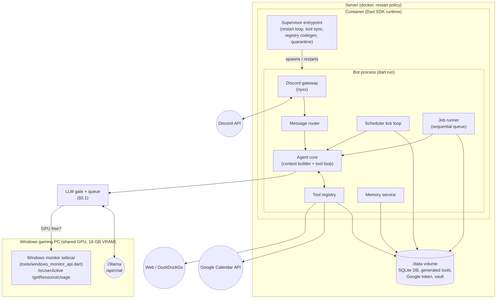
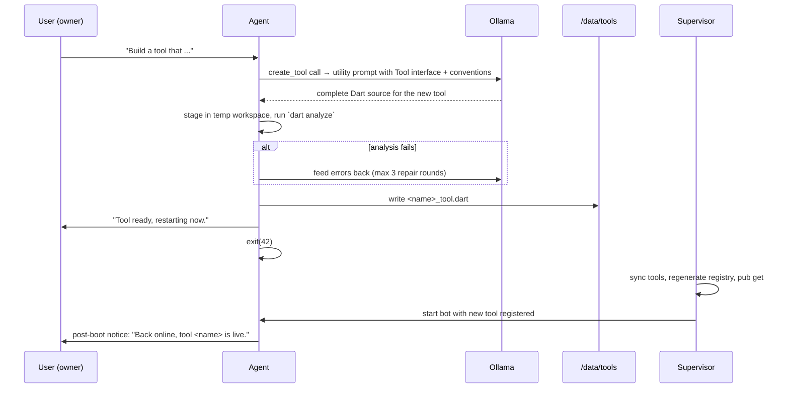

# Egon Bot — Architecture

A personal task executor and daily assistant living on Discord, powered by a local Ollama
instance, written in Dart. This document is the blueprint for the rebuild. The current
code in the repository is the minimal seed (Discord gateway + Ollama client); everything
below describes the target design.

---

## 1. Requirements

| # | Requirement | Covered by |
|---|-------------|-----------|
| R1 | Permanently connected to Discord, always online | §3 Process model |
| R2 | Auto-restart on connection drop or crash | §3 Process model |
| R3 | Memorize text sent directly to the bot | §7 Memory |
| R4 | Scheduled/deferred actions ("remind me in 3 days…") | §8 Scheduler |
| R5 | List its own tools | §6 Tool system (`list_tools`) |
| R6 | Web search | §11 Web tools |
| R7 | Google Calendar integration | §12 Google Calendar |
| R8 | Edit Obsidian notes — vault synced into the container via Obsidian credentials; every change shown as a diff and applied only after owner approval | §13 Obsidian, §6.5 Approvals |
| R9 | Implement its own tools in Dart + restart with new code | §6.4 Self-extension |
| R10 | Query local Ollama for LLM tasks | §5 LLM layer |
| R11 | GPU is shared (16 GB VRAM, gaming PC) — queue big-model calls until the Windows monitor reports the GPU as free | §5.1 GPU gate |
| R12 | Whitelisted users get non-personal features only; dangerous actions by non-owners need owner approval in the same chat | §16 Security, §6.5 Approvals |
| R13 | Idea capture via text **or voice message** — evaluate the idea or preserve it in Obsidian | §10 Inputs |
| R14 | Deep-research jobs: build a step-by-step plan, execute it, report back with a structured document | §9 Jobs |
| R15 | Recover from any outage and resume in-progress work | §9 Jobs, §3 Process model |
| R16 | Incoming work is always queued and executed sequentially | §9 Jobs |
| R17 | Cancel running work mid-flight ("stop researching about wood") | §9 Jobs |
| R18 | Analyze a website / its API, then use that API | §11 Web tools |
| R19 | Scheduled web watchers ("tell me when X goes live") | §8 Watchers |
| R20 | On-demand overview of everything running or scheduled | §9 (`status_overview`) |
| R21 | Address book: "send this document to Jan", with clarifying questions back | §14 Contacts |

## 2. High-level overview



One Dart process does everything (gateway, agent, scheduler). There is deliberately no
microservice split — a single process on a single host with a persistent volume is the
simplest thing that satisfies the requirements.

## 3. Process model — "always online, always restarts" (R1, R2)

Three independent layers of restart protection, from outside in:

### Layer 1 — Docker restart policy
The container runs with `--restart unless-stopped`. Covers host reboots, OOM kills, and
supervisor bugs.

### Layer 2 — Supervisor entrypoint (inside the container)
The container's entrypoint is not the bot itself but a small supervisor loop
(`supervisor/entrypoint.sh`). Responsibilities:

1. Sync self-written tools from `/data/tools/*.dart` into `lib/src/tools/generated/`.
2. Run `dart run tool/generate_tool_registry.dart` (see §6.3).
3. `dart pub get` (offline-first, falls back to network).
4. Start the **Obsidian sync sidecar**: `ob sync --continuous` in `/data/vault`
   (background process, §13). If it dies, the supervisor restarts it independently of
   the bot; the bot keeps running either way.
5. Start the bot: `dart run bin/main.dart`.
6. React to the exit code:

| Exit code | Meaning | Supervisor action |
|-----------|---------|-------------------|
| `0` | Clean shutdown requested | Exit container (docker policy decides) |
| `42` | **Restart requested** (new tool installed, self-update) | Restart immediately, reset backoff |
| anything else | Crash | Restart with exponential backoff (5s → 10s → … → max 300s) |

7. **Crash-loop quarantine**: if the bot crashes ≥3 times within 10 minutes *and* a
   generated tool was added/changed since the last healthy run, the supervisor moves the
   newest file from `/data/tools/` to `/data/tools/quarantine/` and restarts. On the next
   successful boot the bot posts a notice to the owner ("Tool X was quarantined after
   causing crashes"). This guarantees a self-written tool can never permanently brick the
   bot.

### Layer 3 — In-process supervision
- The existing reconnect loop in `bin/main.dart`: if the gateway stream ends or throws,
  reconnect (first retry after 60s, then every 5 minutes). nyxx additionally handles
  transient gateway resumes internally.
- A **watchdog**: the bot records the timestamp of the last received gateway event /
  heartbeat ACK. A periodic timer checks it; if nothing was received for 10 minutes, the
  process calls `exit(1)` and lets Layer 2 restart it. This catches "zombie" connections
  that neither error nor deliver events.

### Consequence for the Docker image
Because the bot must be able to load *new Dart source* after a self-restart (R9), the
runtime image is not a compiled-AOT `debian-slim` image. **There is no compile step at
all** (decided): the image is based on `dart:stable`, the bot runs JIT via `dart run`,
and the seed's Dockerfile already works this way. The image additionally contains
Node.js 22 and the `obsidian-headless` npm package for vault sync (§13), plus `ffmpeg`
and `whisper.cpp` with a speech model for voice-message transcription (§10). Trade-off:
image grows to roughly 1.5 GB and startup takes a few seconds longer — acceptable for a
single long-running bot on a home server.

## 4. Repository layout (target)

```
bin/
  main.dart                     # entrypoint: env, supervisor-aware boot, watchdog
lib/src/
  config.dart                   # typed access to all env vars (§15)
  discord/
    gateway.dart                # connect, intents, reconnect loop
    message_router.dart         # DM / mention / whitelist routing
    discord_actions.dart        # send message, split >2000 chars, typing
  agent/
    agent.dart                  # one "turn": context -> LLM -> tool loop -> reply
    context_builder.dart        # system prompt, history window, relevant memories
    tool_loop.dart              # bounded model<->tool conversation
    approval_service.dart       # diff previews + owner approval buttons (§6.5)
    prompts.dart                # persona + operating instructions
  llm/
    ollama_client.dart          # /api/chat (+ /api/embed later)
    ollama_models.dart          # message/tool-call/tool-schema DTOs
    llm_gate.dart               # GPU-aware FIFO queue in front of the client (§5.1)
  tools/
    tool.dart                   # abstract class Tool + ToolContext + ToolResult
    tool_registry.dart          # lookup, schema export, list_tools rendering
    tool_registry.g.dart        # GENERATED — imports & registers all tools
    builtin/
      list_tools_tool.dart
      web_search_tool.dart
      fetch_url_tool.dart
      remember_tool.dart
      recall_memories_tool.dart
      forget_memory_tool.dart
      schedule_task_tool.dart
      list_scheduled_tasks_tool.dart
      cancel_scheduled_task_tool.dart
      calendar_list_events_tool.dart
      calendar_create_event_tool.dart
      calendar_update_event_tool.dart
      calendar_delete_event_tool.dart
      obsidian_list_notes_tool.dart
      obsidian_read_note_tool.dart
      obsidian_write_note_tool.dart
      obsidian_append_note_tool.dart
      obsidian_delete_note_tool.dart
      obsidian_search_notes_tool.dart
      start_job_tool.dart       # long-running work with a plan (§9)
      cancel_job_tool.dart
      status_overview_tool.dart # everything running/scheduled/waiting (§9)
      watch_url_tool.dart       # scheduled web watchers (§8)
      http_request_tool.dart    # ad-hoc API calls (§11)
      add_contact_tool.dart
      update_contact_tool.dart
      list_contacts_tool.dart
      send_to_contact_tool.dart # DM a document/message to a contact (§14)
      whitelist_user_tool.dart
      unwhitelist_user_tool.dart
      create_tool_tool.dart     # the self-extension tool
      restart_self_tool.dart
      defer_to_big_model_tool.dart  # registered in degraded mode only (§5.1)
    generated/                  # synced from /data/tools at boot, gitignored
  memory/
    memory_service.dart         # store/search/forget, DM auto-capture
  scheduler/
    scheduler.dart              # tick loop, due-task execution, recurrence
    recurrence.dart             # cron parsing / next-occurrence math
    watcher.dart                # watch-task execution: fetch, compare, alert (§8)
  jobs/
    job_runner.dart             # sequential queue, resume, cancellation (§9)
    planner.dart                # instructions -> step plan (utility JSON call)
  media/
    attachments.dart            # download, size cap, files table (§10)
    transcription.dart          # ffmpeg + whisper.cpp voice-to-text (§10)
  contacts/
    contacts_service.dart       # address book + name resolution (§14)
  storage/
    database.dart               # SQLite open/migrate (schema_version pragma)
    migrations.dart
  integrations/
    google_calendar_client.dart
    obsidian_vault.dart         # sandboxed file access to the vault
    windows_monitor_client.dart # client for the GPU monitor sidecar (§5.1)
tool/                           # dev-time scripts (not shipped tools!)
  generate_tool_registry.dart   # codegen for tool_registry.g.dart
  google_calendar_setup.dart    # one-time OAuth consent flow
supervisor/
  entrypoint.sh                 # Layer-2 supervisor (§3)
tools/
  windows_monitor_api.dart      # sidecar: runs ON the Windows gaming PC (not in the
                                # container); reports Parsec activity + GPU load
test/                           # unit tests per subsystem
ARCHITECTURE.md
Dockerfile
deployment.json
```

Persistent volume layout (`/data`, mounted via `deployment.json`):

```
/data/
  egon.db                # SQLite: memories, tasks, jobs, contacts, files, audit log
  files/                 # downloaded attachments + job artifacts (§10)
  tools/                 # self-written tool sources (*.dart)
  tools/quarantine/      # tools removed after causing crash loops
  google/token.json      # OAuth refresh token for Calendar
  vault/                 # Obsidian vault, synced by obsidian-headless (§13)
  obsidian/              # headless client login state + sync config
  state/                 # supervisor bookkeeping (crash counters, last-good marker)
```

## 5. LLM layer (R10)

- `OllamaClient` talks to the local instance at `OLLAMA_API_BASE_URL`
  (default `http://127.0.0.1:11434`) using `/api/chat` with `stream: false`.
- Tool declarations use Ollama's OpenAI-compatible `tools` array; tool results are fed
  back as `role: tool` messages. This already exists in `lib/src/llm/`.
- **Two models, both served by the same Ollama instance, both tool-calling capable:**
  - **Big model** (`OLLAMA_MODEL`, default `gpt-oss:20b`) — runs on the GPU. Every call
    is gated by §5.1.
  - **Utility model** (`OLLAMA_UTILITY_MODEL`, default `llama3.2:3b`) — forced onto the
    CPU with per-request `options: {"num_gpu": 0}` so it **never touches VRAM** and is
    therefore always available, even mid-game. Optionally capped with `num_thread` to
    stay polite to a running game. Set the variable to an empty string to disable the
    tier.
- Two calling modes:
  - **Chat turn**: full persona system prompt + history + memories + all tool schemas.
    Big model when the GPU is free; utility model in degraded mode when it isn't (§5.1).
  - **Utility call**: schema-constrained extraction with no persona (e.g. "parse this
    reminder request into JSON") using Ollama's `format` parameter for guaranteed-JSON
    output. Always the utility model — reminder parsing keeps working while you game.
- Timeouts: 120s per completion (local models are slow); one retry on transport error.

### 5.1 GPU gate and request queue (R11)

Ollama runs on the Windows gaming PC and shares its 16 GB of VRAM with games. The bot
must never load an expensive model while the machine is in use. The **Windows monitor
sidecar** (`tools/windows_monitor_api.dart`, runs on that PC, port 11433) is the source
of truth:

- `/isUserActive` — `true` while a Parsec session is connected.
- `/getResourceUsage` — current + 5-minute-average CPU/GPU utilization.

**No code calls `OllamaClient` directly.** Everything goes through the `LlmGate`
(`lib/src/llm/llm_gate.dart`), a single-worker FIFO queue in front of the client:

```dart
enum ModelTier { big, small }

class LlmJob {
  final ModelTier tier;
  final List<OllamaChatMessage> messages;
  final List<OllamaTool> tools;
  final String? originChannelId;   // where to deliver a deferred answer
  final DateTime enqueuedAt;
  final Completer<OllamaChatMessage> completer;
}
```

`small` jobs run on the utility model (CPU-only) and **bypass the GPU check entirely**.
Gate policy, evaluated before dispatching each `big` job (and re-polled every
`GPU_POLL_INTERVAL_SECONDS`, default 60, while jobs wait):

| Condition | Verdict |
|-----------|---------|
| `isUserActive == true` | busy — someone is on the machine |
| `gpuUsagePercent.avg5m > GPU_BUSY_THRESHOLD_PERCENT` (default 40) | busy — GPU loaded by something else |
| monitor unreachable | **free** — prefer the big model; notify owner after 15 min |
| otherwise | free — dispatch job |

Tier routing:

| Call | Tier |
|------|------|
| Full agent turn, GPU free | big |
| Full agent turn, GPU busy | **small — degraded mode** (see below) |
| Utility calls (reminder parsing, structured extraction, memory tagging) | small, always |
| `create_tool` code generation | big — code quality matters; queued while busy |
| Scheduler `agent` tasks | big — background work, no urgency; deferred while busy |

**Degraded mode** is what makes the assistant usable while you game: when the GPU is
busy, an interactive turn is handled *immediately* by the utility model with the full
toolset — reminders, memory, scheduling, even web search work fine on a 3B model. Its
degraded-mode system prompt says it is the lightweight fallback and instructs it to
call the special `defer_to_big_model` tool (only registered in degraded mode) whenever
the request needs real reasoning. That tool call ends the turn with *"GPU is in use —
I've queued this and will answer properly once it's free."* and enqueues the original
turn as a `big` job.

Behavior of the big-model queue:

- **Queued interactive turns** (via `defer_to_big_model`, or when the utility tier is
  disabled): when the job eventually runs, the answer is posted to `originChannelId` as
  a reply to the original message. Interactive jobs expire after 6 hours with a short
  apology. Queue cap: 20 jobs; beyond that the bot asks the user to try later.
- **Scheduler `agent` tasks**: never enter the in-memory queue while busy. The task's
  `next_run_at` is pushed +5 minutes and it stays `pending` in SQLite — durable across
  restarts, retried until the GPU frees up.

Edge cases:

- **VRAM hygiene**: when the monitor reports the user just became active and no big job
  is mid-flight, the gate immediately unloads the big model from VRAM
  (`/api/generate` with `"keep_alive": 0`) instead of letting Ollama's keep-alive hold
  ~13 GB for another 5 minutes while a game starts.
- Monitor unreachable for >15 minutes → notify the owner once
  ("monitor down, treating GPU as free"). Interactive turns still use the big
  model; only user-active / high GPU load force degraded mode.
- Concurrency is 1 by design: one big model call at a time, so Ollama never holds more
  than one big model's VRAM plus context. Small jobs may run concurrently with a big
  job (different resource pools: CPU vs GPU).
- The queue is in-memory. On a *graceful* restart (exit 42) the bot first posts "I'm
  restarting, please re-send your request" to the origin channels of queued jobs. After
  a crash, queued interactive jobs are simply lost (scheduled tasks are not — they live
  in SQLite).

The seed already contains the first slice of this: `WindowsMonitorClient`, and a message
loop that answers via the CPU-only utility model while the GPU is busy (refusing only if
the utility tier is disabled). The queue and degraded-mode toolset arrive with the full
agent.

## 6. Tool system (R5, R9)

### 6.1 The `Tool` interface

Every capability — built-in or self-written — implements one abstract class:

```dart
/// Who may trigger a tool, and what it takes (§16 for the full matrix).
enum ToolAccess {
  /// Any whitelisted user: web search, list_tools, reminders in shared chats.
  standard,

  /// Owner only — personal data: calendar, Obsidian, memory listing.
  personal,

  /// Owner runs it directly; a whitelisted user's request pauses and asks
  /// the owner for approval in the same channel: create_tool, restart_self.
  dangerous,
}

abstract class Tool {
  /// Unique snake_case identifier, e.g. `web_search`.
  String get name;

  /// One-paragraph description shown to the LLM. Must state when to use it,
  /// what it returns, and when NOT to use it.
  String get description;

  /// JSON Schema (draft-07 subset Ollama understands) for the arguments.
  Map<String, Object?> get parametersJsonSchema;

  ToolAccess get access => ToolAccess.standard;

  /// Non-null = this tool's effect must be previewed and approved by the
  /// owner before [execute] runs (§6.5). Obsidian writes return a unified
  /// diff here; calendar mutations a human-readable summary.
  Future<String?> previewChange(
    ToolContext context,
    Map<String, Object?> args,
  ) async => null;

  /// Execute the call. Must not throw for expected failures — return
  /// ToolResult.error() instead so the LLM can react.
  Future<ToolResult> execute(ToolContext context, Map<String, Object?> args);
}

class ToolContext {
  final String channelId;
  final String userId;
  final bool isOwner;
  final Services services; // db, memory, scheduler, calendar, vault, registry, discord
}

class ToolResult {
  final Map<String, Object?> json;   // fed back to the model verbatim
  ToolResult.ok(this.json);
  ToolResult.error(String message) : json = {'error': message};
}
```

### 6.2 Registry and `list_tools` (R5)

`ToolRegistry` holds all instances, exports their schemas for the Ollama call, dispatches
tool calls by name, enforces `ToolAccess` and the approval flow (§6.5), and writes every
invocation (name, args, caller, duration, success) to the `tool_audit_log` table. The built-in `list_tools` tool renders
name + description + origin (`builtin` / `self-written`) as the tool result, so the model
can answer "what can you do?" accurately.

### 6.3 Registry code generation

Dart cannot load code at runtime (no reflection-based plugin loading in AOT/JIT without
isolates + mirrors complexity), so registration is done by **codegen at boot**:

`tool/generate_tool_registry.dart` scans `lib/src/tools/builtin/` and
`lib/src/tools/generated/`, and writes `tool_registry.g.dart`:

```dart
// GENERATED — do not edit.
import 'builtin/web_search_tool.dart';
import 'generated/pomodoro_timer_tool.dart';
// ...

List<Tool> buildAllTools(Services services) => [
  WebSearchTool(services),
  PomodoroTimerTool(services),
  // ...
];
```

Convention for discoverability: one tool per file, file name `<tool_name>_tool.dart`,
class name is the PascalCase of the file name, constructor takes `Services`. The
generator validates this convention and skips (and reports) files that violate it.

### 6.4 Self-extension: `create_tool` (R9)

Flow when the user says "build yourself a tool that does X":



Safety rails:
- `create_tool` is `ToolAccess.dangerous`: the owner triggers it directly; a whitelisted
  user's request pauses and asks the owner for approval in the same channel (§6.5).
- Static validation before install: `dart analyze` must be clean; the file must contain
  exactly one class extending `Tool`; the tool name must not collide with an existing one.
- The generated source may only import `dart:*` core libraries, `package:http`, and the
  bot's own `tool.dart` — enforced by a simple import whitelist check on the source.
- Crash-loop quarantine (§3) as the last line of defense.
- "Back online" notice: the bot writes a `pending_notice` row before exiting and posts it
  to the originating channel after boot, so restarts are visible in chat.

`restart_self` is a trivial `dangerous` tool that just exits with code 42 — useful after
manual edits on the host.

### 6.5 Approval flow

One `ApprovalService` covers both confirmation cases:

1. **Change previews** — a tool with a non-null `previewChange` (every Obsidian write,
   calendar mutations) must be approved by the owner before it executes, *no matter who
   asked* — including the owner himself. R8: the bot shows the diff first.
2. **Dangerous escalation** — a whitelisted user triggers a `dangerous` tool; the owner
   must allow it in the same channel.

Mechanics:

- The registry pauses the tool call and posts an approval request **to the channel the
  request came from**: a short header (who wants what), the preview rendered in a
  code block (unified diff for notes, truncated to Discord's 2 000-char limit with a
  full version attached as a file when longer), and two message-component buttons —
  **Approve** / **Reject** — plus the requester's mention.
- Only the owner's button clicks count; anyone else's are answered ephemerally with
  "only Michael can approve this".
- Approvals are persisted in SQLite so a restart doesn't orphan them:

```sql
CREATE TABLE pending_approvals (
  id            INTEGER PRIMARY KEY AUTOINCREMENT,
  created_at    TEXT NOT NULL,
  channel_id    TEXT NOT NULL,
  message_id    TEXT,                 -- the approval-request message
  requested_by  TEXT NOT NULL,
  tool_name     TEXT NOT NULL,
  args_json     TEXT NOT NULL,
  preview       TEXT,
  status        TEXT NOT NULL DEFAULT 'pending'  -- pending|approved|rejected|expired
);
```

- On **Approve** the stored call executes and the result flows back into the paused tool
  loop (or, if the loop already ended, is posted as a fresh message: "Applied ✔ — …").
  On **Reject** the tool returns `ToolResult.error('rejected by owner')` so the model
  can tell the user. Requests expire after 24 hours (buttons disabled, status
  `expired`).
- While a turn has a pending approval, the tool loop finishes with a natural
  interim reply ("I've prepared the edit — waiting for Michael's OK"), because approval
  latency is human-scale and the LLM turn must not block for hours.

## 7. Memory (R3)

### Storage
SQLite (via `sqlite3` package + `libsqlite3` in the image) at `/data/egon.db`.

```sql
CREATE TABLE memories (
  id          INTEGER PRIMARY KEY AUTOINCREMENT,
  created_at  TEXT NOT NULL,            -- ISO-8601 UTC
  user_id     TEXT NOT NULL,
  channel_id  TEXT,
  content     TEXT NOT NULL,
  source      TEXT NOT NULL,            -- 'dm' | 'explicit' | 'agent'
  tags        TEXT                      -- comma-separated, optional
);
CREATE VIRTUAL TABLE memories_fts USING fts5(content, tags, content=memories);

CREATE TABLE conversation_log (         -- rolling per-channel history
  id          INTEGER PRIMARY KEY AUTOINCREMENT,
  channel_id  TEXT NOT NULL,
  author_id   TEXT NOT NULL,
  author_name TEXT NOT NULL,
  created_at  TEXT NOT NULL,
  content     TEXT NOT NULL
);
```

### Capture
- **Every DM** to the bot is stored as a memory (`source = 'dm'`) *and* handled as a
  conversation turn. That is the literal reading of R3: text sent directly to him is
  memorized.
- In guild channels, messages are logged into `conversation_log` (short-term context,
  pruned to the last 200 per channel) but only promoted to `memories` when the user asks
  ("remember that …") or the agent calls the `remember` tool itself.

### Retrieval
- `recall_memories(query, limit)` → FTS5 match, most recent first.
- The context builder additionally runs an automatic FTS query derived from the incoming
  message and injects the top 5 hits into the system prompt under a
  `## Things you remember` section, so the bot uses its memory without being asked.
- `forget_memory(id)` deletes; `list_memories` (owner DM only) pages through everything.
- Embedding-based retrieval via Ollama `/api/embed` is a later optimization, not in v1.

## 8. Scheduler (R4)

### Data model

```sql
CREATE TABLE scheduled_tasks (
  id            INTEGER PRIMARY KEY AUTOINCREMENT,
  created_at    TEXT NOT NULL,
  created_by    TEXT NOT NULL,          -- user id
  channel_id    TEXT NOT NULL,          -- where the result gets posted
  kind          TEXT NOT NULL,          -- 'message' | 'agent' | 'watch'
  payload       TEXT NOT NULL,          -- message text, agent instruction, or watch spec
  state_json    TEXT,                   -- watcher snapshot/state between runs
  due_at        TEXT,                   -- one-shot: ISO-8601 UTC
  recurrence    TEXT,                   -- cron expression (5-field), or NULL
  timezone      TEXT NOT NULL DEFAULT 'Europe/Berlin',
  status        TEXT NOT NULL DEFAULT 'pending',  -- pending|done|cancelled|missed
  last_run_at   TEXT,
  next_run_at   TEXT NOT NULL
);
CREATE INDEX idx_tasks_due ON scheduled_tasks(status, next_run_at);
```

Two task kinds keep the common case cheap:
- `message`: post `payload` verbatim to `channel_id`. Used for plain reminders — no LLM
  round-trip at fire time.
- `agent`: run a full agent turn with `payload` as a synthetic user instruction, tools
  enabled ("every Sunday, check the weather and post a summary"). The agent acts in the
  stored channel on behalf of `created_by`.

### Creating tasks
The `schedule_task` tool takes structured arguments
(`kind, payload, due_at | recurrence, channel_id?`). Natural-language time parsing
("in 3 days", "on Sunday", "every Monday at 9") is done by the LLM inside the chat turn —
the system prompt includes the current date/time in `Europe/Berlin`, and the tool
description instructs the model to convert to an absolute ISO timestamp or a cron
expression itself. A utility-mode validation call is *not* needed; the tool validates the
timestamp/cron server-side and returns an error the model can correct.

Example — "Remind me in 3 days in this chat that I want to go to the mall" becomes:

```json
{ "kind": "message",
  "payload": "Reminder: you wanted to go to the mall.",
  "due_at": "2026-07-30T09:35:00Z" }
```

### Execution
- A `Timer.periodic` tick every 30 seconds queries
  `status='pending' AND next_run_at <= now`.
- One-shot: run → `status='done'`. Recurring: run → compute next occurrence from the cron
  expression in the task's timezone → update `next_run_at`.
- **Downtime policy**: at boot, tasks overdue by less than 6 hours are executed
  immediately with a "(delayed)" prefix; older ones are marked `missed` and the owner is
  notified. Recurring tasks skip missed occurrences and resume at the next one.
- **GPU interplay** (§5.1): `message` tasks fire regardless of GPU state (no LLM call
  involved). `agent` tasks check the gate first; while the GPU is busy their
  `next_run_at` is pushed +5 minutes so they stay durable in SQLite instead of sitting
  in the in-memory queue.
- `list_scheduled_tasks` / `cancel_scheduled_task(id)` round out the management surface.

### Watchers: scheduled web scrapers (R19)

"Tell me when the ticket shop goes live" is a recurring `watch` task created by the
`watch_url` tool:

```
watch_url(url, condition, interval, until_triggered = true)
```

Each run is cheap and GPU-free:

1. `fetch_url` the page (same extraction pipeline as §11).
2. Compare against the previous snapshot stored in `state_json` (content hash + the
   text region relevant to the condition).
3. If the content changed, the **utility model** (CPU, always available) evaluates the
   condition against old vs new text: *"has it gone live?"*.
4. If triggered: post an alert to the originating channel with the evidence quote and
   the URL. With `until_triggered` (the default) the watcher then marks itself `done`;
   otherwise it keeps watching (e.g. price monitoring).

Watchers are ordinary scheduled tasks: they appear in `list_scheduled_tasks` and
`status_overview`, and are cancelled with `cancel_scheduled_task`. Minimum interval
15 minutes to stay polite to the target site. Watchers created by whitelisted users are
capped at 3 per user; the owner is uncapped.

## 9. Jobs — long-running work (R14–R17, R20)

A chat turn (§6) lasts seconds to minutes. *"Analyze how to properly seal wood
outdoors, summarize in a small document, find good products, check the local Bauhaus
first"* lasts much longer, needs a plan, and must survive restarts. That is a **job**.

### Life cycle

```
queued ──► planning ──► running ──► done
                          │  ▲         ├─► failed
                          ▼  │         └─► cancelled
                       waiting_user
```

### Data model

```sql
CREATE TABLE jobs (
  id            INTEGER PRIMARY KEY AUTOINCREMENT,
  created_at    TEXT NOT NULL,
  created_by    TEXT NOT NULL,
  channel_id    TEXT NOT NULL,          -- where progress + report get posted
  title         TEXT NOT NULL,          -- short label, e.g. "wood sealing research"
  instructions  TEXT NOT NULL,          -- the user's full request, verbatim
  plan_json     TEXT,                   -- [{step, description, status, summary}]
  current_step  INTEGER,
  status        TEXT NOT NULL DEFAULT 'queued',
                -- queued|planning|running|waiting_user|done|failed|cancelled
  question      TEXT,                   -- pending question while waiting_user
  progress_log  TEXT,                   -- append-only notes, persisted per step
  result        TEXT,                   -- final report (markdown)
  updated_at    TEXT NOT NULL
);
```

### Planning

The `start_job` tool creates the row; the `JobRunner` asks the **big model** (utility
JSON call, gated) to expand `instructions` into a plan of 2–10 concrete steps. For the
wood example that looks like:

```json
["Research wood sealing methods for outdoor use (web_search + fetch_url)",
 "Research recommended product categories and ingredients to avoid",
 "Search bauhaus.info for matching products, collect names + prices + links",
 "Broaden product search to other German retailers as fallback",
 "Write summary document to Obsidian: Inbox/Research/Holz versiegeln.md",
 "Post short report with top product picks to the channel"]
```

The plan is posted to the channel once ("Here's my plan — say stop anytime"), then
execution starts. No approval needed to *start* — only individual mutating tool calls
inside the job go through §6.5 as usual (e.g. writing the Obsidian document).

### Execution — strictly sequential (R16)

- `JobRunner` is a singleton worker: **one job runs at a time**, others wait in
  `queued`, FIFO. New requests while a job runs get "queued behind ⟨current job⟩".
- Each step is executed as a bounded tool loop (§6) whose goal is that step's
  description, with the accumulated summaries of previous steps as context.
- After every step the plan status, a step summary, and `progress_log` are persisted —
  this is the resume point. A progress message is posted at step boundaries for jobs
  with more than 2 steps.
- Job LLM calls are `big`-tier: while you game, the job simply pauses at the gate and
  the progress log notes "waiting for GPU". No VRAM is ever stolen from a game by a
  background job.

### Cancellation (R17)

Two paths, same effect:

- Explicit: the `cancel_job` tool.
- Natural language: while a job is running, every new owner message in that channel is
  first classified by the **utility model** (CPU, instant): *"is this a cancel/change
  request for the running job ⟨title⟩?"*. "Stop researching about wood" → yes.

Cancellation sets a flag that the runner checks between tool calls and between steps —
a long tool call finishes, but nothing new starts. The job posts what it had so far
("Cancelled. Partial findings: …") and is marked `cancelled`.

### Clarifying questions

Any step may conclude that it needs input (missing detail, ambiguous contact, a choice
between options). The job posts the question in its channel, moves to `waiting_user`,
and — so one stuck question never blocks everything (R16 applies to *active* work) —
the next queued job may start. The owner's reply re-queues the waiting job at the front.

### Outage recovery (R15)

On boot the runner scans the jobs table:

- `running` → the current step restarts from its beginning. Read-only tools simply run
  again; mutating tools were either already applied (visible in `progress_log`) or go
  through approval again — no double writes.
- `queued` / `waiting_user` → untouched, still valid.
- A notice is posted: "Back online, resuming ⟨title⟩ at step 3/6."

Combined with §3 (crash restarts) and the scheduler's downtime policy, every kind of
outage ends with the bot picking its work back up.

### Reporting

The final step of research-type plans is always twofold: the full structured document
goes to the Obsidian vault (diff-approved, §6.5), and a short digest (≤ 2 000 chars)
with the key findings and links is posted to the channel.

### `status_overview` (R20)

One tool renders the whole runtime state whenever you ask "what are you working on?":

- active job with current step and elapsed time,
- queued jobs and `waiting_user` questions,
- upcoming reminders and scheduled tasks (next 5),
- active watchers with last-checked time,
- pending approvals,
- GPU gate state (free / busy / monitor down) and queued big-model calls.

## 10. Inputs: voice messages and attachments (R13)

### Attachments

The message router downloads every attachment on messages addressed to the bot
(≤ 25 MB) into `/data/files/` and records it:

```sql
CREATE TABLE files (
  id          INTEGER PRIMARY KEY AUTOINCREMENT,
  created_at  TEXT NOT NULL,
  channel_id  TEXT NOT NULL,
  message_id  TEXT NOT NULL,
  user_id     TEXT NOT NULL,
  name        TEXT NOT NULL,
  mime        TEXT NOT NULL,
  path        TEXT NOT NULL
);
```

"Send *this document* to Jan" resolves "this document" to the most recent file in the
channel (the context builder injects the last few file records). Text-like attachments
(txt, md, json, csv, pdf via `pdftotext`) can also be read into context on request.

### Voice messages

Discord voice messages arrive as ogg/opus attachments with a voice-message flag.
Pipeline, running entirely on the bot's server CPU (never the gaming PC):

```
ogg/opus ──ffmpeg──► 16 kHz mono wav ──whisper.cpp (WHISPER_MODEL, default small)──► text
```

The transcript is then handled exactly like a typed message — same routing, memory
capture, and agent turn — prefixed `(voice message)` so the model knows transcription
noise is possible. `ggml-small` (~460 MB, in the image) handles German and English
well; a voice memo of a minute transcribes in a few seconds on server CPU.

### Idea capture

No special mechanics needed on top: a text or voice DM lands as a normal agent turn,
and the persona instructions say — *if the owner shares an idea, either discuss and
evaluate it when asked, or preserve it via `obsidian_append_note` to
`Inbox/Ideas.md` (date-stamped) when he wants it saved; when unclear, ask which.*
The append is diff-approved like every vault write, so a one-tap Approve completes the
capture.

## 11. Web tools (R6, R18)

Port of the previous implementation (recoverable from git history, commit `2bca07a`),
repackaged as two `Tool` classes:

- `web_search(query)` — keyless scraping of DuckDuckGo's `lite` HTML endpoint; returns up
  to 5 `{title, snippet, url}` entries, snippets capped at 280 chars.
- `fetch_url(url)` — GET a public http(s) URL, strip HTML noise, return
  `{url, title, text, content_type, truncated}` capped at 8 000 chars. Text-like MIME
  types only.

### API analysis and usage (R18)

"Look at this website, figure out their API, then use it" decomposes into existing
pieces plus one new tool:

- **Analysis**: the agent uses `fetch_url` on the site, then probes the usual suspects —
  `/openapi.json`, `/swagger.json`, `/api`, developer-docs links found on the page — and
  summarizes endpoints, auth requirements, and parameters. (Limitation worth knowing:
  no JavaScript execution; SPAs that only reveal their API in the browser's network tab
  need you to paste an example request.)
- **Usage**: `http_request(method, url, headers?, body?)` makes the actual API calls.
  `ToolAccess.personal`; non-GET methods (anything that mutates remote state) show a
  preview approval (§6.5) with the exact request before it is sent. Private/loopback
  address ranges are blocked so a prompt-injected page can't probe the home network.
- **Permanence**: when an API turns out to be useful repeatedly, the natural follow-up
  is "make yourself a tool for this" → `create_tool` (§6.4) generates a dedicated,
  typed tool wrapping that API.

Prompt-injection note: content fetched from the web is untrusted. The tool loop tags web
results, and the system prompt instructs the model to never treat fetched text as
instructions. Additionally, `personal`/`dangerous` tools cannot be *triggered by* a turn
whose requesting user isn't the owner regardless of what fetched content says (enforced
in the registry, not the prompt).

## 12. Google Calendar (R7)

- Packages: `googleapis` (CalendarApi) + `googleapis_auth`.
- Auth: **OAuth 2.0 desktop-app flow with a stored refresh token** (a service account
  cannot access a personal calendar without Workspace domain delegation).
  - One-time setup: `dart run tool/google_calendar_setup.dart` prints the consent URL,
    the user pastes the redirect code, and the script writes
    `/data/google/token.json` (refresh token + client id/secret).
  - At runtime the client auto-refreshes access tokens; if the refresh token is revoked,
    calendar tools return a "re-run setup" error instead of crashing.
- Tools (all `ToolAccess.personal`; mutations show a preview approval):
  - `calendar_list_events(time_min, time_max, query?)`
  - `calendar_create_event(summary, start, end, description?, location?)`
  - `calendar_update_event(event_id, ...changed fields)`
  - `calendar_delete_event(event_id)`
- **Decided: writes go to a dedicated "Egon" calendar.** The setup script creates it if
  missing and stores its id in `/data/google/config.json`; reads cover all calendars
  visible to the account (so the bot sees your real appointments too), writes/updates/
  deletes are restricted to the Egon calendar. `GOOGLE_CALENDAR_ID` overrides the write
  target if ever needed.
- All timestamps are converted to/from `Europe/Berlin` for the model, RFC 3339 on the
  wire.

## 13. Obsidian integration (R8)

**Decided: the vault is synced into the container with Obsidian account credentials**,
using the official **Obsidian Headless** client
([`obsidian-headless`](https://github.com/obsidianmd/obsidian-headless), open beta,
npm, Node.js ≥ 22) — released 2026, made exactly for this ("give agentic tools access
to a vault without access to your full computer"). Requires an active Obsidian Sync
subscription.

Setup, performed by the supervisor at boot (idempotent):

```bash
ob login --email "$OBSIDIAN_EMAIL" --password "$OBSIDIAN_PASSWORD"   # skipped if already logged in
cd /data/vault
ob sync-setup --vault "$OBSIDIAN_VAULT_NAME" [--password "$OBSIDIAN_E2EE_PASSWORD"]
ob sync --continuous &        # sidecar, restarted independently if it dies
```

Notes on the sync sidecar:
- `ob sync --continuous` watches the folder, so the bot's file writes are uploaded
  within seconds and your edits from desktop/phone arrive the same way. E2E encryption
  is preserved end to end; the E2EE password is only needed for e2ee-encrypted vaults.
- Login state and vault config live under `/data` so they survive container rebuilds.
- Headless is in open beta: the boot sequence treats a failed `ob` invocation as
  non-fatal (bot starts anyway, note tools return "vault sync unavailable"), and the
  Obsidian help docs warn against running desktop Sync and Headless Sync *on the same
  device* — different devices, as here, are the intended use.

The `ObsidianVault` service wraps all access with sandboxing: every path is resolved
against the vault root and must stay inside it after symlink/`..` resolution. **The bot
has full write access to the entire vault** (decided) — any file type, including
`.obsidian/` if explicitly asked. Writes are atomic (temp file + rename).

The real safety net is the **diff approval** (§6.5): every mutating note tool
implements `previewChange`, producing a unified diff (or "new file" preview) that is
posted to the chat with Approve/Reject buttons. Nothing is written until the owner
approves — including edits the owner requested himself.

Tools (all mutating ones are `ToolAccess.personal` + preview-approved):
- `obsidian_list_notes(folder?)` — relative paths, recursive.
- `obsidian_read_note(path)`
- `obsidian_write_note(path, content)` — create or overwrite; preview = diff vs current
  content.
- `obsidian_append_note(path, content)` — preview = the appended block in diff form.
- `obsidian_delete_note(path)` — preview = "deletes N lines" summary.
- `obsidian_search_notes(query)` — case-insensitive content grep, returns path + matching
  lines.

## 14. Contacts and sending documents (R21)

The address book lives in SQLite:

```sql
CREATE TABLE contacts (
  id               INTEGER PRIMARY KEY AUTOINCREMENT,
  created_at       TEXT NOT NULL,
  name             TEXT NOT NULL,      -- canonical: "Jan Müller"
  aliases          TEXT,               -- comma-separated: "jan,jan m,müller"
  discord_user_id  TEXT,               -- delivery target
  notes            TEXT                -- free text: "climbing group", "brother of ..."
);
```

Tools (all `ToolAccess.personal`): `add_contact`, `update_contact`, `list_contacts`,
and the interesting one:

- `send_to_contact(contact_query, file_ref?, message?)`
  1. **Resolve the contact**: case-insensitive match on name + aliases. Exactly one hit
     → proceed. Zero or several → the bot asks back in the same chat: *"Which Jan do
     you mean? I know Jan M. and Jan K."* — in a chat turn that's just the reply; inside
     a job the job moves to `waiting_user` (§9). The answer can extend the address book
     ("the third one, add him: discord id …").
  2. **Resolve the document**: `file_ref` may be the most recent attachment in the
     channel (default for "this document"), a URL to fetch, an Obsidian note path, or a
     file generated by a previous step.
  3. **Preview approval** (§6.5): recipient, file name/size, and the accompanying
     message are shown; nothing leaves before Approve.
  4. **Deliver**: the bot opens a DM to `discord_user_id` and sends the file + message,
     then confirms with a link. Constraint: Discord bots can only DM users who share a
     server with the bot — the tool reports this cleanly when delivery fails, and falls
     back to offering the file in the current channel.

## 15. Configuration

All configuration via environment variables (dotenv locally, `-e` flags in
`deployment.json` in production), typed in `lib/src/config.dart`:

| Variable | Required | Default | Purpose |
|----------|----------|---------|---------|
| `DISCORD_BOT_TOKEN` | yes | — | Gateway auth |
| `OWNER_USER_ID` | yes | — | Discord user id of the owner (`personal`/`dangerous` tools, approvals) |
| `ALLOWED_CHANNEL_IDS` | no | *(empty = DMs only)* | Comma-separated guild channel whitelist |
| `OLLAMA_API_BASE_URL` | no | `http://127.0.0.1:11434` | Ollama endpoint |
| `OLLAMA_MODEL` | no | `gpt-oss:20b` | Big model (GPU, gated); must support tool calling |
| `OLLAMA_UTILITY_MODEL` | no | `llama3.2:3b` | Small model, CPU-only (`num_gpu: 0`), always available; empty string disables the tier |
| `WINDOWS_MONITOR_API_BASE_URL` | no | *(unset = gating disabled)* | GPU monitor sidecar on the Ollama machine (§5.1) |
| `GPU_BUSY_THRESHOLD_PERCENT` | no | `40` | 5-min-avg GPU load above which big calls wait |
| `GPU_POLL_INTERVAL_SECONDS` | no | `60` | Re-poll interval while jobs are queued |
| `DATA_DIR` | no | `/data` | Volume root |
| `BOT_TIMEZONE` | no | `Europe/Berlin` | Scheduler + prompt timestamps |
| `OBSIDIAN_EMAIL` | for notes | — | Obsidian account email (headless sync login, §13) |
| `OBSIDIAN_PASSWORD` | for notes | — | Obsidian account password |
| `OBSIDIAN_VAULT_NAME` | for notes | — | Remote vault name to sync |
| `OBSIDIAN_E2EE_PASSWORD` | no | — | Only for end-to-end-encrypted vaults |
| `OBSIDIAN_VAULT_DIR` | no | `/data/vault` | Local sync target |
| `GOOGLE_CALENDAR_ID` | no | *(auto: "Egon" calendar)* | Write-target calendar override |
| `WHISPER_MODEL` | no | `small` | whisper.cpp model for voice transcription (§10) |
| `MAX_ATTACHMENT_MB` | no | `25` | Attachment download cap (§10) |

The privileged **Message Content Intent** is enabled in the developer portal (decided),
so the bot reads guild messages that don't mention it and can build conversation
context. The seed connects with `allUnprivileged | messageContent`.

## 16. Security model

Three actor roles and three tool tiers (decided):

| | `standard` tools (search, list_tools, reminders…) | `personal` tools (calendar, notes, memory listing) | `dangerous` tools (create_tool, restart_self) |
|---|---|---|---|
| **Owner** (`OWNER_USER_ID`) | runs | runs (note/calendar writes still show a diff/preview first, §6.5) | runs |
| **Whitelisted user** | runs | refused — personal features are never available to others | paused → owner is asked in the same channel, runs only on Approve |
| **Everyone else** | ignored | ignored | ignored |

- **User whitelist**: stored in SQLite (`whitelisted_users` table), managed by the owner
  via `whitelist_user(user_id)` / `unwhitelist_user(user_id)` tools — no redeploy needed
  to add a friend. The owner is implicitly whitelisted.
- **Enforcement location**: all of the above lives in `ToolRegistry.dispatch` and the
  message router, never in the prompt.
- **Channel whitelist**: guild messages outside `ALLOWED_CHANNEL_IDS` are ignored.
- **Vault sandbox**: §13.
- **Generated-code limits**: import whitelist + `dart analyze` gate + quarantine (§6.4).
  Note the honest limitation: a self-written tool still runs with the bot's full OS
  privileges inside the container. The container itself is the sandbox — it gets no
  volume mounts beyond `/data` and runs as a non-root user.
- **Audit trail**: every tool invocation logged to `tool_audit_log`
  (`id, at, tool, caller, channel, args_json, ok, duration_ms`).
- **Secrets** never enter the prompt; the config object redacts itself in `toString`.

## 17. Failure modes and recovery

| Failure | Detected by | Recovery |
|---------|-------------|----------|
| Gateway disconnect | nyxx / event stream ends | in-process reconnect loop (60s, then 5 min) |
| Zombie connection (no events, no error) | watchdog (10 min silence) | `exit(1)` → supervisor restart |
| Unhandled exception / crash | process exit ≠ 0/42 | supervisor restart with backoff |
| Bad self-written tool crashes boot | crash-loop counter | quarantine newest tool, notify owner |
| Host reboot / OOM kill | docker | `--restart unless-stopped` |
| Ollama down / timeout | HTTP error | reply "brain offline" to the user; scheduler retries `agent` tasks once after 5 min |
| GPU busy (user gaming / high load) | LLM gate poll (§5.1) | interactive: answer immediately via CPU utility model (degraded mode), hard requests queued for the big model; scheduled `agent` tasks: defer +5 min in SQLite |
| Windows monitor unreachable | gate poll fails | treat GPU as free (big model); notify owner once after 15 min |
| Reminders due during downtime | boot scan | ≤6h late: fire with "(delayed)"; older: mark `missed`, notify owner |
| Job interrupted by crash/restart | boot scan of jobs table | resume at the current step, post "resuming ⟨job⟩ at step n/m" (§9) |
| Watcher target site down/changed markup | fetch error / empty extraction | keep previous snapshot, retry at next interval; warn owner after 3 consecutive failures |
| Voice transcription fails | whisper/ffmpeg error | reply "couldn't understand the voice message, please type it" |
| Google token revoked | 401 on refresh | calendar tools return setup instructions |
| Obsidian sync sidecar dies / login fails | supervisor process watch | restart sidecar with backoff; note tools return "vault sync unavailable" instead of writing stale files |
| SQLite corruption | open/migrate failure | supervisor keeps last-known-good backup `/data/state/egon.db.bak` (rotated daily), restores and notifies |

## 18. Decisions and proposed extras

All previously open questions are decided:

- **Models (§5.1)**: two tiers — `gpt-oss:20b` on the GPU (gated), `llama3.2:3b`
  CPU-only, always available. Pull once with `ollama pull llama3.2:3b`.
- **Obsidian (§13)**: vault synced into the container via the official
  `obsidian-headless` client using account credentials; full write access to the whole
  vault; every change diff-approved in chat before it is applied.
- **Audience (§16)**: owner gets everything; whitelisted users get non-personal
  features; their dangerous requests need owner approval in the same channel.
- **Web search (§11)**: keyless DuckDuckGo-lite scraping.
- **Runtime (§3)**: run from source, no compile step, `dart:stable` + Node 22 image.
- **Message Content Intent (§15)**: enabled in the developer portal.
- **Google Calendar (§12)**: dedicated "Egon" calendar for writes, all visible
  calendars for reads. One-time OAuth desktop-app consent flow.
- **Persona**: German "Egon" persona in whitelisted group channels; neutral, concise
  assistant voice in owner DMs.

Proposed extras — not yet committed, say yes/no per item:

1. **Morning briefing** — a recurring `agent` task (e.g. 07:30) posting today's
   calendar, due reminders, active jobs/watchers, and anything new in `Inbox/Ideas.md`.
   Cheap to build (it's just a scheduled task once phases 1–5 exist).
2. **"What did you do today?"** — an audit-log summary tool: every tool call is already
   recorded (§6.2), this renders it as a daily activity report.
3. **Memory consolidation** — a weekly job that condenses accumulated memories into a
   tidy Obsidian note and prunes duplicates, keeping FTS recall sharp.
4. **Email integration** — read/summarize/send via IMAP/SMTP. Genuinely useful for an
   assistant but a separate credential + security surface; only worth it if you want it.

## 19. Implementation order

Each phase leaves the bot deployable and useful on its own:

1. **Core agent**: `Tool` interface, registry (hand-written list first), tool loop,
   `list_tools`, SQLite storage, config, access tiers + user whitelist, and the
   **LLM gate + queue** (§5.1) so the shared GPU is respected from day one. Port
   `web_search`/`fetch_url` from git history as the first real tools.
2. **Approvals + memory**: `ApprovalService` with buttons and persistence (§6.5); DM
   auto-capture, `remember`/`recall_memories`/`forget_memory`, automatic memory
   injection into context.
3. **Scheduler**: task table, tick loop, `schedule_task`/`list`/`cancel`, downtime
   policy. This delivers the "remind me next Thursday 8 am" flow end to end.
4. **Jobs**: `JobRunner`, planner, sequential queue, cancellation (tool + natural
   language), resume-on-boot, `status_overview`. This delivers the deep-research flow.
5. **Self-extension runtime**: supervisor entrypoint, registry codegen, `create_tool`
   with analyze gate + quarantine, exit-code-42 protocol, dangerous-tool escalation.
6. **Obsidian**: headless-sync sidecar in the supervisor, vault service, note tools
   with diff previews. Unlocks research reports and idea capture end to end.
7. **Media + contacts**: attachment pipeline, whisper.cpp voice transcription, contacts
   table and `send_to_contact` with clarification flow.
8. **Google Calendar**: setup script (creates the Egon calendar), client, four calendar
   tools with previews.
9. **Watchers + API usage**: `watch_url` on the scheduler, `http_request` with
   private-network blocking, API-analysis prompt playbook.
10. **Hardening**: watchdog, audit log review, DB backup rotation, tests for scheduler
    recurrence, vault sandboxing, approval expiry, and job resume.
