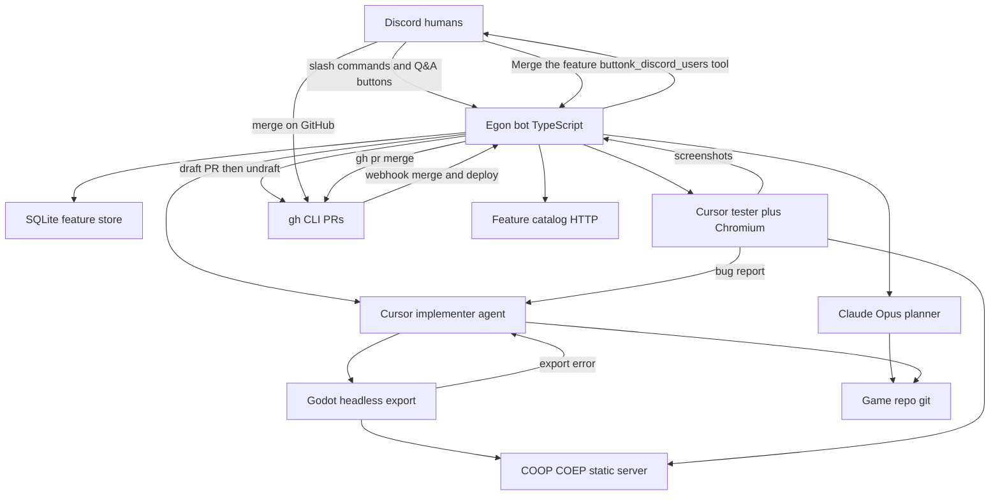

# Egon spec

Source of truth for the orchestrator. Milestone work orders say **how to build a slice**. This file says **what must remain true**. If a milestone conflicts with this spec, this spec wins — stop and ask.

This repo is the orchestrator (Discord bot, Cursor SDK runners, Godot export/serve, Docker image). The Godot game lives in a **separate, already-created repo** cloned at boot from `GAME_REPO_HTTPS_URL`. There is one game and one working tree.

## Product flow

Humans talk in one Discord channel, then drive the pipeline with slash commands. Merge happens on GitHub or via the **Merge the feature** Discord button; there is no accept/reject slash command.

1. Collect ideas (`/egon-new-feature`, `/egon-add`, `/egon-add-to-feature`).
2. `/egon-plan` starts the **planner** (Claude Opus 5 via the Agent SDK; Cursor only if Claude cannot start because of Anthropic usage/spend/billing limits). Independent questions go to Discord as one `ask_discord_users` call (at most **2 rounds**, **5 questions total**; each item states a default). The channel still shows them one at a time with answer buttons. The first button or modal response is the answer for that item; unanswered items take the stated default. Global answers (art style, camera, control scheme, palette) accumulate in `docs/GAME_DECISIONS.md` so later features do not re-ask them.
3. Before the planner runs, the bot checks out `origin/$GAME_REPO_BRANCH` and creates branch `egon/{slug}-{YYYYMMDDTHHMMSSZ}` (UTC, seconds; a new feature never reuses an older branch of the same slug). Discord images are copied into `assets/egon/{slug}/`. The planner writes `docs/features/{slug}/SPEC.md` in the game repo. After each answered Q&A round the bot updates `docs/GAME_DECISIONS.md` from global answers. On `PLAN_COMPLETE` the bot validates that spec (required headings, at most 3 numbered criteria, no leftover `{placeholder}`), sending one follow-up if it fails. When the spec passes, the bot commits it (assets, and `docs/GAME_DECISIONS.md` when it changed), pushes the branch, opens a **draft** pull request, copies the spec into `$DATA_DIR/features/{id}/SPEC.md`, and posts the PR URL in Discord.
4. A local Cursor **implementer** edits the game repo on that branch. The agent does not commit or push. Its last message is a structured summary (files changed, criteria self-verified, deviations) that the bot hands to the tester. After a successful run the bot commits, pushes, and **un-drafts** the PR (spec-only commits stay draft).
5. A debug **web** export is served locally. A **new** Cursor **tester** agent exercises the spec's acceptance criteria in Chromium and posts screenshots. Tester PASS/FAIL does not change draft status. `COULD NOT VERIFY` counts as overall PASS.
6. Clear tester FAILs and Godot web-export failures go back to the implementer (tester report or Godot stderr). The first two test cycles resume the same agent. After cycle 2, a **new** implementer is seeded with the SPEC, acceptance criteria, the report, and the feature-branch git diff. The bot commits and pushes each fix. Export and test again until overall PASS or the retry cap.
7. Power users merge the PR on GitHub or click **Merge the feature** on the Discord review-ready message. `/egon-pivot` steers the implementer without converting the PR back to draft. GitHub notifies the bot via webhook so it can clean up. After the game's **Build and deploy** GitHub Action succeeds, the bot posts a Discord one-liner with the catalog-linked feature name and a live play link.



One Docker container runs all of this. Cursor IDE is **not** installed. The planner runs via `@anthropic-ai/claude-agent-sdk`; implementer and tester run via `@cursor/sdk` inside the bot Node process. The GitHub CLI (`gh`) authenticates git over HTTPS, clones the game repo, and creates/un-drafts PRs. `git` still branches, commits, and pushes.

## Concurrency

Many features may collect ideas at once. **Only one feature may be in plan → implement → test at a time**, because there is a single game working tree. `/egon-plan` fails if another pipeline is active. `/egon-stop` cancels that active work. If planning never opened a PR, the feature returns to `collecting` and the lock is released. After a PR exists, the feature goes to `awaiting_review` and the lock stays until the GitHub PR is merged (or closed without merge). Uncommitted agent edits are discarded.

## Feature state machine

`collecting` → `planning` → `implementing` → `exporting` → `testing` → `fixing` (loop back to export) → `awaiting_review` → `accepted` (GitHub merge + cleanup) or `rejected` (PR closed unmerged) or `pivoting` → `implementing`

A failed debug export from `exporting` also enters `fixing` (same retry cap as tester FAIL).

`/egon-pivot` is valid from `awaiting_review` and from `rejected`. GitHub merge may also move `implementing` / `exporting` / `testing` / `fixing` / `pivoting` → `accepted` if a power user merges before the tester finishes.

Open features (for `/egon-list`) are every state except `accepted`.

## Environment

Validate in `src/config.ts`. Fail fast on missing required vars. Document every key in `.env.example`. No hardcoded channel, repo, or secrets.

Required:

- `DISCORD_TOKEN`, `DISCORD_APP_ID` — bot credentials
- `DISCORD_CHANNEL_ID` — the only channel the bot listens in; ignore slash commands and Q&A buttons elsewhere
- `DISCORD_GUILD_ID` — register guild slash commands here (instant, not global)
- `CURSOR_API_KEY` — Cursor SDK (implementer, tester, and Cursor planner fallback)
- `CLAUDE_CODE_OAUTH_TOKEN` — Claude Agent SDK (Opus planner); long-lived token from `claude setup-token`
- `GAME_REPO_HTTPS_URL` — git remote of the single game repo (e.g. `https://github.com/org/game.git`)
- `GITHUB_TOKEN` — fine-grained PAT for `gh` and git HTTPS (clone, fetch, push, create draft PR, mark ready, view on boot catch-up, watch **Build and deploy**). Needs **Contents: Read and write**, **Pull requests: Read and write**, and **Actions: Read** on the game repo.
- `GITHUB_WEBHOOK_SECRET` — HMAC secret for `POST /github/webhook`

Optional with defaults:

- `GAME_REPO_DIR` — clone destination, default `/game`
- `GAME_REPO_BRANCH` — default `master`
- `GIT_AUTHOR_NAME` / `GIT_AUTHOR_EMAIL` — commit identity for bot commits
- `CURSOR_MODEL_IMPLEMENTER` — default `grok-4.6` (implementer and Cursor planner fallback)
- `CURSOR_MODEL_IMPLEMENTER_EFFORT` — default `high` (`none` / `low` / `medium` / `high` / `xhigh`)
- `CURSOR_MODEL_TESTER` — default `composer-2.5` (highest call volume, lowest reasoning demand)
- `CURSOR_MODEL_TESTER_EFFORT` — default `low` (checklist execution; same allowed values as implementer). Claude planner model and effort are not env: hardcoded `claude-opus-5` at `high`.
- `DATA_DIR` — default `/data` (SQLite, Cursor agent store, Claude sessions under `$DATA_DIR/claude`, screenshots, attachments, specs)
- `WEB_SERVE_PORT` — local Godot export server (`127.0.0.1`)
- `FEATURES_HTTP_PORT` — public catalog + webhook server, default `10001` (`0.0.0.0`)
- `FEATURES_PUBLIC_URL` — public base URL for Discord catalog links and the GitHub webhook URL, default `https://egon.mbuelow.dev`
- `CURSOR_ADMIN_API_KEY` — optional; official remaining-usage % via Admin pooled-usage

On boot: `gh auth setup-git`, then if `GAME_REPO_DIR` is empty, `gh repo clone $GAME_REPO_HTTPS_URL`; otherwise `git remote set-url origin $GAME_REPO_HTTPS_URL` and fetch. The bot never pushes `GAME_REPO_BRANCH` directly. Feature work is pushed on `egon/{slug}-{YYYYMMDDTHHMMSSZ}`; humans merge that PR on GitHub or via **Merge the feature**.

Configure a GitHub repository webhook on the game repo: URL `{FEATURES_PUBLIC_URL}/github/webhook`, content type JSON, secret `GITHUB_WEBHOOK_SECRET`, events **Pull requests** and **Workflow runs**.

## Discord commands

Keep **one registry** (name + short description + handler). `/egon-help` renders that registry so the list cannot drift. Commands only work in `DISCORD_CHANNEL_ID`.

| Command | Meaning |
| --- | --- |
| `/egon-help` | List every command with its short explanation (ephemeral) |
| `/egon-new-feature name` | Create feature; becomes this channel's "latest" |
| `/egon-add text [image]` | Append note to latest feature in this channel; optional image is stored and sent to Cursor |
| `/egon-add-to-feature name text [image]` | Append to a named feature; same optional image |
| `/egon-list` | Open features (not `accepted`): name, state, note count, PR link |
| `/egon-plan [name]` | Start planner for a named feature, or this channel's latest if omitted; fail if another pipeline is active |
| `/egon-pivot text [image]` | Change request from `awaiting_review` or `rejected`; re-enter implement + test; optional image is stored and sent to Cursor |
| `/egon-retry` | Cancel a stuck planner/implementer/tester and continue from the current phase (or from `awaiting_review` / `rejected`) |
| `/egon-stop` | Cancel the in-flight planner, implementer, or tester (and any Discord Q&A wait) |
| `/egon-status` | Current pipeline feature + state + last agent activity + PR link |

There is **no** `/egon-accept` or `/egon-reject`. Merge on GitHub or click **Merge the feature** on the review-ready Discord message; pivot in Discord.

`/egon-add` errors if this channel has no latest feature. `/egon-plan` without `name` uses that same latest feature and errors the same way if there is none. `/egon-new-feature` includes an **Add specifics** button (modal) for that feature; `/egon-plan` removes it. After implement + test, the review-ready message includes **Merge the feature**; the bot removes that button after a merge (Discord click or GitHub webhook).

Optional `image` on `/egon-add`, `/egon-add-to-feature`, and `/egon-pivot` must be PNG, JPEG, GIF, or WebP. The bot downloads it immediately (Discord CDN URLs expire) into `$DATA_DIR/features/{id}/attachments/` and records it in SQLite. When `/egon-plan` creates branch `egon/{slug}-{YYYYMMDDTHHMMSSZ}`, the bot copies those files into `assets/egon/{slug}/` in the game repo (and again before the implementer runs). The orchestrator commits them with the spec. The first planner and implementer turn also attach the files as vision input (Claude: `SDKUserMessage` image blocks; Cursor: `agent.send({ text, images })`). Follow-ups stay text-only, except `/egon-pivot` with an image attaches that new file as vision on the implementer follow-up, and tester FAIL rounds attach criterion screenshots as vision on the fix follow-up. Text remains required; extra images are additional `/egon-add` or `/egon-pivot` invocations. Paste the file with the `image` option — a URL in `text` is not downloaded at add time (the implementer may still fetch http(s) URLs from notes).

### Q&A buttons

The planner passes **all independent questions in one** `ask_discord_users` call (`questions: [{ question, default, choices?, topic? }]`, at most 3 choices each). `topic` is `art-style`, `camera`, `control-scheme`, or `palette` for game-wide choices. At most **2 rounds** and **5 questions total** for the plan. Discord still posts them **one by one**. Unanswered items take the question's stated `default` (including Discord timeout; remaining items in that round also take their defaults). A later call is only for follow-ups that depend on earlier answers, and only if budget remains. After the budget, write the spec with those defaults — do not `PLAN_BLOCKED` for unanswered details. After a round completes, the bot records matching answers into `docs/GAME_DECISIONS.md` on the feature branch (keyword-match if `topic` is omitted). That file is committed with the spec.

The bot posts the current question in the channel. When it offers numbered options, the message includes **1.**, **2.**, **3.** (as applicable) plus **Answer other**. Numbered buttons submit that choice immediately; **Answer other** (or **Answer** when there are no numbered options) opens a modal. **The first successful button or modal answer wins.** Persist `plannerBackend`, `plannerAgentId`, the in-flight question batch, the current `pending_question`, and the question message id so a bot restart can finish remaining Discord items sequentially, then resume **that** backend with every collected Q and A in one follow-up.

Enable Guilds intent (slash commands, buttons, and modals).

## Cursor SDK

Always pass `local: { cwd: GAME_REPO_DIR }` and `apiKey` explicitly. Implementer (and Cursor planner fallback) from `CURSOR_MODEL_IMPLEMENTER` (default `grok-4.6`) with `params: [{ id: "reasoning", value: CURSOR_MODEL_IMPLEMENTER_EFFORT }]` (default `high`). Tester from `CURSOR_MODEL_TESTER` (default `composer-2.5`) with independent `CURSOR_MODEL_TESTER_EFFORT` (default `low`). Use `Agent.create` + `send` + `wait`, not one-shot `prompt`. Log `agent.agentId` and `run.id` immediately after `send()`. Stream tool calls to docker logs. If stream events stop, docker heartbeats and `/egon-status` / the catalog show last activity; after **60 minutes** of silence cancel the run (no Discord warning). Planner silent threshold is **30 minutes** because Opus `high` thinking can stay quiet. Waiting on `ask_discord_users` is idle, not stuck. `/egon-retry` cancels a stuck run and continues the pipeline from the current phase. Distinguish `CursorAgentError` (never started) from `result.status === "error"` (ran and failed). Dispose with `await using` / `close()`. Persist local Cursor agent state under `$DATA_DIR/cursor-agents`. Claude planner sessions persist under `$DATA_DIR/claude`.

Do **not** install the Cursor IDE. The SDK local executor runs in-process.

### Planner

Primary planner is `@anthropic-ai/claude-agent-sdk` with hardcoded `model: "claude-opus-5"` and `effort: "high"` (native 1M context; no `PLANNER_MODEL` env). Thinking is `{ type: "adaptive", display: "summarized" }`. Tools: Read, Glob, Grep, Write, Edit, plus MCP `mcp__egon__ask_discord_users`. No Bash, Agent, or WebSearch. `canUseTool` allows Write/Edit only for `docs/features/{slug}/SPEC.md`. Persist `plannerBackend: "claude" | "cursor"` next to `plannerAgentId` so resume never feeds a Cursor id into `query({ resume })` or a Claude session id into `Agent.resume`.

On a **new** plan, try Claude first. Persist `plannerBackend = "claude"` only after the Claude session actually starts. Fall back to the Cursor planner only when Claude **does not start this query** because of Anthropic usage/spend/billing limits (402 `billing_error`, spend-cap 429, specified usage-limit 400). Do **not** fall back on 401/auth, 529 overloaded, transient 429 with `retry-after`, network, `PLAN_BLOCKED`, cancel, or a Claude run that already produced work. If a later `/egon-retry` cannot start that Claude session because of usage limits, start a **fresh** Cursor planner with the full prompt plus any Discord answers already collected. On fallback, post in Discord that Claude hit a usage limit and Cursor is taking over.

The Cursor planner remains the fallback (`customTools.ask_discord_users`, same `questions[]` schema). Implementer and tester stay on Cursor either way.

Writes `docs/features/{slug}/SPEC.md` **in the game repo** on branch `egon/{slug}-{YYYYMMDDTHHMMSSZ}`. Discord images collected with `/egon-add` are attached as vision on the first turn and already sit at `assets/egon/{slug}/`.

The planner system / instruction block includes the spec sheet template (`templates/spec-sheet.md`). The written spec **must** keep those headings in order: Context & Goal, Scope (in / out), Relevant files / existing code, Interface / Contract, Implementation notes / constraints, Verification hooks, Acceptance criteria, Explicitly NOT this task. Fill every required section; do not leave placeholders.

On `PLAN_COMPLETE` the bot **validates the file in code** before accepting it (existence is not enough): required template headings present and in order, a numbered acceptance-criteria list of at most **3** items, and no leftover `{placeholder}` from the template. If that check fails, the same planner gets **one** targeted follow-up listing the problems. If the spec is still invalid, treat it as not complete — do not commit, copy, or open a PR.

The first planner turn also includes `$DATA_DIR/GAME_MAP.md` when it exists (a deterministic index of the last merged Godot tree). Prefer that map over exploratory Glob/Grep/Read. If the file is missing (no merge yet), the orchestrator generates one from the current checkout.

The first planner turn also includes `docs/GAME_DECISIONS.md` from the current checkout when it exists (accumulated art style, camera, control scheme, palette). Treat filled headings as settled — do not re-ask Discord unless this feature must change one. If a heading is missing and this feature depends on it, ask and set `topic`. Questions drop toward zero as the game matures. The orchestrator writes this file from answered Q&A; `canUseTool` still allows Write/Edit only for the spec.

The Claude system prompt is constant (no feature slug) and holds the spec-sheet template plus planner rules so they prompt-cache. First-turn user messages are static-first: `GAME_MAP.md`, then `GAME_DECISIONS.md`, then feature name, spec path, and notes — so the remaining shared prefix can prompt-cache across features. Cursor planner/implementer/tester prompts follow the same order (instruction block with template and/or Godot CLI cheat sheet, then game map, then per-feature text). Planner prompts also include game decisions after the game map.

**Verification hooks** is required. The spec must name a debug bridge the implementer exposes: Godot `JavaScriptBridge` → `window.__egon.state()` returning JSON, listing every field acceptance criteria will read.

**Acceptance criteria** is a numbered list of at most **3** checks. Never more than 3. The first planner turn injects the tester's exact capability list (`src/cursor/testerCapabilities.ts`, matching Playwright MCP with `--caps=vision`, `--snapshot-mode=none`, `--viewport-size=960x540`, and no `devtools` cap). Each item must name the concrete tester interaction — **Keys** (`browser_press_key` names, or `none`), **Click** (`browser_mouse_click_xy` viewport x,y in that 960×540 space, or `none`), **JS** (exact `() => …` that reads `window.__egon.state()`), **Then** (expected JSON / field values) — not English prose and not pixel guesses. The tester can click, move, and drag at coordinates on the Godot canvas. It cannot read GDScript/scene-tree state except via that debug bridge. Do not put "no SCRIPT ERROR" / "no console errors" in §7 — the tester always checks that as implicit criterion 0 via `browser_console_messages` (core, `level: "error"`). Do not require capturing a single frame of a fast animation. They are definition of done for the implementer (self-check) and the test plan for the tester, who never runs more than 3 criteria. The planner must make the spec as specific as possible and ask Discord questions until material details are precise and certain — at most 2 rounds, 5 questions total; if a detail stays unanswered use the stated default. Do not `PLAN_BLOCKED` for unanswered details. Do not re-ask filled `GAME_DECISIONS` headings. Pass every independent unknown in **one** `ask_discord_users` call. Planner may read existing game code; it must not write outside that spec file.

End with a one-line `PLAN_COMPLETE` or `PLAN_BLOCKED` marker the orchestrator can parse. Do not commit or push; the orchestrator commits the spec after `PLAN_COMPLETE` **and** the schema check passes.

### Implementer

Separate agent from the planner. Resume it for the first fix rounds and for pivots (`implementerAgentId` on the feature). After two test cycles (`MAX_TEST_CYCLES` is 3), the next fix creates a **new** implementer instead of `Agent.resume`: first `send` is the full implementer prompt plus the SPEC text, parsed acceptance criteria, tester/export report, and `git diff origin/$GAME_REPO_BRANCH...HEAD` (truncated). Persist the new `implementerAgentId`. Implement the game-repo SPEC only: honor Scope, Out of scope, Implementation notes, Verification hooks, and Explicitly NOT this task, expose `window.__egon.state()` as specified, and self-check Acceptance criteria by reading that JSON before finishing. Modify only the files listed in SPEC §3 plus files the implementer creates; anything else must be justified under **Deviations** in the structured final message. Download asset URLs from feature notes into the Godot project. Discord images are attached as vision on the first `send` and already copied to `assets/egon/{slug}/` for import. A `/egon-pivot` image is copied the same way and attached as vision on that follow-up `send`. Tester FAIL rounds attach `criterion-1.png` … `criterion-N.png` as vision on the fix follow-up — the PNGs are the evidence, not just the report prose. Work on the feature branch already checked out.

Do **not** commit or push; the orchestrator commits after the agent finishes. Do not edit `deployment.json` — `ensureDeploymentBump` on every implementer push guarantees the version bump.

The first implementer `send` includes a short Godot CLI cheat sheet (`GODOT_CLI_GUIDE`, ~15 lines: import, parse-check changed `.gd`, smoke-run, grep — no all-scripts `xargs`, no `--verbose`, no export), a pre-compiled Godot 4 web gotcha list (`src/cursor/godotWebGotchas.ts`; never loaded from disk), and the same `GAME_MAP.md` as the planner, static-first (cheat sheet, then gotchas, then game map, then feature name/notes). The full `docs/godot-cli.md` is copied into the game repo for on-demand Read. Each gotcha is a repeat failure class: `thread_support=true` means SharedArrayBuffer/COOP-COEP; guard `JavaScriptBridge` with `OS.has_feature("web")`; never hand-edit `.uid` files; `class_name` must be globally unique; no addons; do not touch `export_presets.cfg` (`ensureWebExportPreset` owns it). The first send also injects the SPEC's parsed acceptance-criteria list (`parseAcceptanceCriteria`, at most 3 items) so the implementer can self-check without opening the SPEC just to find them. Before finishing, the implementer must `--import`, parse-check changed `.gd` files (`--script … --check-only`), smoke-run with `--quit-after` / `--scene`, and grep the log with `rg -n --max-count 20`. Never `cat` a Godot log — a `--verbose` log is tens of thousands of lines and will blow the context window. Do not Web-export; `runExportTestLoop` debug-exports after the agent finishes. Always `--headless --path .`. Never `--test`, `--editor` / `-e`, or `--debug` unattended. Logs go under `/tmp`.

The implementer's last message is structured: **Files changed**, **Criteria self-verified**, **Deviations**. Follow-up sends (fixes, pivots, resume) remind the agent to end the same way. On a finished run the orchestrator writes `$DATA_DIR/features/{id}/IMPLEMENT_SUMMARY.md` and injects it into the tester prompt as claims to verify independently — not as evidence. Do not post that summary to Discord.

### Tester

**New agent every test cycle.** Before creating it, confirm Playwright Chrome for Testing exists **and actually launches**. Playwright MCP from the bot install (`node node_modules/@playwright/mcp/cli.js --headless --browser=chromium --caps=vision --snapshot-mode=none --viewport-size=960x540`), not `npx` in the game tree. Default snapshot mode is `full` (an accessibility tree on every action); `none` because the Godot page is a single canvas. Viewport is explicit so §7 click coordinates are stable and screenshots stay small (960×540 ≈ 0.9k tokens vs Playwright's 1280×720 default ≈ 1.6k; up to 15 shots/run). Vision cap enabled (no `devtools`): named `browser_press_key` taps, `browser_mouse_click_xy` / `browser_mouse_move_xy` / `browser_mouse_drag_xy` at viewport coordinates (in-canvas sprites, Control buttons, HUD), `browser_evaluate` of a `() => …` on the page (reading `window.__egon.state()`), `browser_console_messages` (core, `level: "error"`) for Godot `SCRIPT ERROR` lines in the web console, and screenshots for human proof. No Godot inspector, no pixel-guessing pass/fail. Prompt pointing at `http://127.0.0.1:{WEB_SERVE_PORT}` plus `GAME_MAP.md`. Do not tell the tester to Read the SPEC — §7 is injected verbatim, plus a compact facts block compiled from that map (controls, canvas size, expected boot time, known HUD elements). Boot wait is one `browser_evaluate` that polls the Godot HTML shell (`#status` / `#status-progress` / `#status-notice`) and canvas pixels until the engine has started — not a visual "canvas looks ready" guess, and not a listed-criterion attempt. `#status-notice` or a still-blank canvas is listed `[FAIL]` (game did not boot). Implicit criterion 0 is no `SCRIPT ERROR` in the console (a game that throws every frame but still renders a static scene must `FAIL`); check after boot wait returns ready and again after the last §7 item; mark `[PASS]`/`[FAIL]` only — never `COULD NOT VERIFY`. Harmless console noise without `SCRIPT ERROR` is not a fail. Given the SPEC acceptance-criteria list (at most 3 items; extra items are ignored); execute the Keys, Click, and JS each item names and judge from the JSON return. Missing `__egon.state` is `FAIL`. **At most 5 attempts per listed criterion** (replay, reload, or wait and read again). Each listed criterion is `PASS`, `FAIL`, or `COULD NOT VERIFY`. `FAIL` only when the game is clearly wrong (including `SCRIPT ERROR` in the console). `COULD NOT VERIFY` when the tester cannot evaluate the named JS after the attempt cap — keep the last screenshot and continue; do not loop. Listed `COULD NOT VERIFY` counts as overall `PASS` so humans can merge. Writes screenshots under `$DATA_DIR/features/{id}/screenshots/` and a `TEST_REPORT.md` with those marks. The tester passes `filename: criterion-N.png` on the Playwright screenshot (a relative name stays in `--output-dir`); `publish_screenshot` only renames if Playwright saved a different file. Discord posts the per-criterion breakdown (including `COULD NOT VERIFY`); the review-ready sentence names the unverified count instead of claiming every criterion passed. Discord and the catalog proof gallery attach only `criterion-1.png` … `criterion-N.png` (at most 3); leftover Playwright dumps stay on disk and are not posted. Overall `PASS` only if criterion 0 is `PASS` and no listed criterion failed. Overall `FAIL` if criterion 0 is not `PASS` or any listed criterion fails; the orchestrator `send`s that report plus the criterion screenshots as vision to the implementer. The tester prompt also includes the latest implementer summary when one exists; treat it as claims, not as pass/fail evidence.

Planner and implementer do **not** need a browser. The tester does. Chromium lives in the same container.

Local SDK agents have no built-in browser, GUI, or `listArtifacts`. Screenshots are files the bot uploads to Discord and serves on the catalog. They are **not** deleted after merge.

### Presence = remaining Cursor usage

Every Cursor agent run goes through one wrapper (`sendAndWait`). Claude planner runs go through `queryPlanner`. A `finally` block runs whether the run finished, errored, cancelled, or threw — planner, implementer, tester, and bug-fix follow-ups. Log Anthropic `total_cost_usd` from the Claude result message for planner runs. Presence stays Cursor remaining usage (implementer/tester).

Discord activity: `Watching 73% left` (integer percent remaining). On fetch failure: `Watching usage n/a`. Also refresh once on bot ready.

**Do not use `Agent.getUsage()` for this.** That API is billed tokens/cost for *one agent*, not remaining plan quota. Cursor plans are a monthly included usage pool (spend). Remaining % = `remaining / limit` for the current billing period.

Fetch order:

1. If `CURSOR_ADMIN_API_KEY` is set, official Admin `POST /organizations/pooled-usage` (`remainingCents` / `limitCents`).
2. Else `POST https://api2.cursor.sh/aiserver.v1.DashboardService/GetCurrentPeriodUsage` with `CURSOR_API_KEY` and parse `planUsage` (cents used vs included).
3. If both fail, log and set `usage n/a`. Never fail the pipeline because presence failed.

Usage fetch must not throw into the orchestrator. Single-flight if two agents end at once.

## Godot web loop

Web export only (browser game). Pin Godot 4.x plus matching **web export templates** in the Dockerfile.

Debug export:

```
godot --headless --path "$GAME_REPO_DIR" --export-debug "Web" /tmp/egon-web/index.html
```

The export path **must** end in `.html`. If `--export-debug` fails, `runExportTestLoop` sends Godot's stderr to the implementer as a fix round instead of aborting the pipeline. Same retry cap as tester FAIL.

Serve with:

- `Cross-Origin-Opener-Policy: same-origin`
- `Cross-Origin-Embedder-Policy: require-corp`

(SharedArrayBuffer.) One local port; stop/replace the server each export.

Headless Chromium screenshots without a host desktop/X11. Runtime image is `mcr.microsoft.com/playwright:v1.63.0-noble` plus Mesa hardware drivers (`libgl1-mesa-dri`, `libglx-mesa0`, `libegl-mesa0`, `libgbm1`, `libvulkan1`, `mesa-vulkan-drivers`, `mesa-va-drivers`). The stock Playwright image has no Mesa drivers and silently uses SwiftShader. Docker run passes `/dev/dri/renderD128` (never `card1` — that needs DRM master and fails with `amdgpu_get_auth failed`), `--group-add` the host GID of that node, `--ipc=host`, and `--shm-size=2g`. No DISPLAY, X socket, or Xorg. After host PCI changes, confirm the render node with `ls -l /dev/dri/by-path/`. Launch Chromium with `--use-gl=angle --use-angle=vulkan` (`--use-angle=gl` silently falls back to SwiftShader). Before the tester runs, evaluate the WebGL renderer and fail unless it matches `/RADV|AMD/` (expected: `ANGLE (AMD, Vulkan … (RADV POLARIS12) …), radv`).

## GitHub PRs, pivot, merge

**Branch + draft PR** after `PLAN_COMPLETE` and the spec schema check: commit spec on `egon/{slug}-{YYYYMMDDTHHMMSSZ}` (name chosen at plan start and stored on the feature), `git push`, `gh pr create --draft` against `GAME_REPO_BRANCH`. Copy SPEC into `$DATA_DIR/features/{id}/SPEC.md`.

**Un-draft** after the first implementer commit that actually has a diff (`gh pr ready`). Later fix-cycle commits push to the same PR; `gh pr ready` is idempotent. Do not convert back to draft on pivot.

**`deployment.json`:** bump the version vs `origin/$GAME_REPO_BRANCH` on every implementer commit path (`ensureDeploymentBump`). Do not ask the implementer to edit that file. Host deploy watches `deployment.json` on the default branch after merge.

**`/egon-pivot`:** valid from `awaiting_review` or `rejected`. Append the change request (and optional image), re-enter implement + test on the same branch and PR.

**`/egon-stop`:** valid while the locked feature is `planning`, `implementing`, `exporting`, `testing`, `fixing`, or `pivoting`. Cancels the in-flight planner (Claude abort or Cursor cancel), implementer, or tester (and any Discord Q&A waiter), and Godot export. No PR → `collecting` and release the lock (fresh `/egon-plan` later). With a PR → `awaiting_review` (merge on GitHub, `/egon-retry` to continue the same work, or `/egon-pivot`).

**`/egon-retry`:** valid while the pipeline lock is held in a plan/implement/test state, `awaiting_review`, or `rejected`. Cancels the in-flight Cursor run if any, keeps feature state (or re-enters `pivoting` from review/rejected), and continues the chain. Does not discard uncommitted work.

**Merge:** humans merge on GitHub or click **Merge the feature** on the Discord review-ready message (`gh pr merge`). The bot then runs the same cleanup as a GitHub-side merge. `POST /github/webhook` verifies `X-Hub-Signature-256`, then on `pull_request` `closed` + `merged: true`: fetch, checkout `$GAME_REPO_BRANCH`, pull, stop the web server, delete the export dir, mark `accepted`, **keep** spec copy and screenshots, write `$DATA_DIR/GAME_MAP.md` from the merged tree (Godot version, renderer, main scene, viewport, autoloads, input bindings, physics layer names, per-`.tscn` node trees, per-`.gd` public surface, and a feature index from each `docs/features/{slug}/SPEC.md` §1 — no LLM), release the pipeline lock, and strip **Merge the feature**. Do **not** post a merge notice. Then wait for the game repo's **Build and deploy** workflow (the same reusable action as lets-vibe-together). Wait on the merge commit (`gh pr view --json mergeCommit`) and ignore any run that started before `mergedAt`, so an earlier deploy is never treated as this one. Wait up to 20 minutes for the run to appear, then `gh run watch`. On success, post a Discord notice in the vibe channel. If Discord is down, do not mark the feature announced — a later `workflow_run` webhook or catch-up can retry.

```
✅ Successfully deployed feature {feature name linked to catalog}. You can [test it live](<$GAME_PUBLIC_URL>) now!
```

If no pending feature (manual deploy), use `owner/repo` as the title. A `workflow_run` webhook for that workflow is an alternate path to the same notice (idempotent per Actions run id). Workflow failure posts `Deploy failed` with a link to the run; the feature stays pending so a re-run can still announce success. Closed without merge → `rejected` and a Discord notice; strip **Merge the feature**; lock stays so humans can `/egon-pivot`. The catalog keeps the feature and labels the PR **closed**. Delete from the catalog removes it and closes the PR if it is still open.

Do **not** poll GitHub on an interval. After a merge (webhook, boot catch-up, or catalog page load), wait on that deploy workflow with `gh run watch`. On boot and when serving the catalog index or a feature page, one `gh pr view` per non-accepted feature that already has a PR number (catch up if a webhook arrived while the process was down, or never arrived). Coalesce overlapping catch-ups and skip a repeat within 10 seconds. Plus a deploy wait if any accepted feature still needs a deploy notice.

## Feature catalog

A public HTTP server (separate from the Godot debug server) binds `0.0.0.0:$FEATURES_HTTP_PORT`:

- Index: Collecting (`collecting` ideas from `/egon-new-feature` and `/egon-add`), Planned (every other state, including in-progress planning before a spec exists), and Implemented (`accepted`), with links to detail. Every card (and its detail page) has a **Delete** action. It prompts for password `ente123`, then `POST /features/{slug}/delete`. Wrong password → 403. Delete removes the feature from the catalog only — it does not revert git. If the feature still has an open GitHub PR, delete closes it (`gh pr close`). A closed-unmerged PR stays in Planned labeled **PR #N (closed)** until someone deletes it.
- Detail `/features/{slug}`: name, state, PR link, collected notes, Discord reference images, SPEC, proof screenshots, and the full agent log (prompts we sent plus what the agent printed, including tool calls). Images are served at `/features/{slug}/attachments/{file}`.
- Persist each planner / implementer / tester run under `$DATA_DIR/features/{id}/agent-log.jsonl`. The file is written when the run starts (prompt) and updated as stream events arrive, so a catalog refresh shows in-flight output — not only the finished run. A running entry that has gone silent is marked possibly stuck. If that file is missing, the catalog hydrates from the Cursor agent store using `plannerAgentId` / `implementerAgentId` only when `plannerBackend` is not `"claude"`.
- `POST /github/webhook` as above.

Catalog reads SQLite plus `$DATA_DIR/features/{id}/` so it does not depend on which git branch is checked out.

## Docker (final image, built incrementally)

Single service. Long-running Node bot (`docker --init`). Persist `/data` and optionally `/game`. Clone from `GAME_REPO_HTTPS_URL` at boot. No Cursor IDE. Chromium (ANGLE Vulkan on RADV), Godot CLI, git, a small agent CLI toolkit (`python3`, `jq`, `ripgrep`, `xxd`, and similar), and a pinned `gh` binary belong in the image. Publish `FEATURES_HTTP_PORT`.

```
/app          bot source
/game         cloned Godot repo (GAME_REPO_DIR)
/data         sqlite, Cursor agent store, Claude sessions, screenshots, attachments, specs
```

Node.js **22.13+** (required by `@cursor/sdk`).

## Answers to open questions

1. **Does Cursor need a browser to debug the game?** Local SDK agents have no built-in browser. Only the tester needs Chromium in the container (Playwright MCP or thin Playwright tools). Planner and implementer only need the game repo on disk.
2. **Headless host and screenshots?** Need Chromium + Mesa Vulkan drivers in the image and the host render node (`renderD128`), not a desktop session or X11. Playwright headless screenshots without DISPLAY. Use `--use-angle=vulkan`; `--use-angle=gl` and the stock Playwright image silently fall back to SwiftShader. Assert `/RADV|AMD/` on the WebGL renderer.

## Out of scope

- Multiple game repos
- Non-web Godot exports
- Cursor cloud runtime
- Cursor IDE in the container
- Bot merging the PR
- Parallel implement/test of two features
