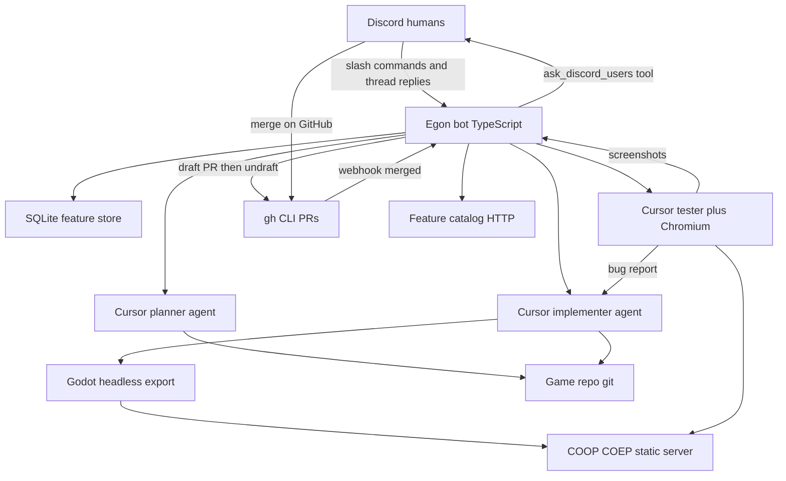

# Egon spec

Source of truth for the orchestrator. Milestone work orders say **how to build a slice**. This file says **what must remain true**. If a milestone conflicts with this spec, this spec wins — stop and ask.

This repo is the orchestrator (Discord bot, Cursor SDK runners, Godot export/serve, Docker image). The Godot game lives in a **separate, already-created repo** cloned at boot from `GAME_REPO_HTTPS_URL`. There is one game and one working tree.

## Product flow

Humans talk in one Discord channel, then drive the pipeline with slash commands. **Merge happens on GitHub**, not via Discord accept/reject.

1. Collect ideas (`/egon-new-feature`, `/egon-add`, `/egon-add-to-feature`).
2. `/egon-plan` starts a local Cursor **planner**. Questions go to a Discord thread; the first message that **mentions the bot** is the answer.
3. Before the planner runs, the bot checks out `origin/$GAME_REPO_BRANCH` and creates branch `egon/{slug}`. Discord images are copied into `assets/egon/{slug}/`. The planner writes `docs/features/{slug}/SPEC.md` in the game repo. On `PLAN_COMPLETE` the bot commits the spec (and those assets), pushes the branch, opens a **draft** pull request, copies the spec into `$DATA_DIR/features/{id}/SPEC.md`, and posts the PR URL in Discord.
4. A local Cursor **implementer** edits the game repo on that branch. The agent does not commit or push. After a successful implementer run the bot commits, pushes, and **un-drafts** the PR (spec-only commits stay draft).
5. A debug **web** export is served locally. A **new** Cursor **tester** agent exercises the spec's acceptance criteria in Chromium and posts screenshots. Tester PASS/FAIL does not change draft status.
6. Bugs go back to the same implementer. The bot commits and pushes each fix. Export and test again until overall PASS or the retry cap.
7. Power users merge the PR on GitHub. `/egon-pivot` steers the implementer without converting the PR back to draft. GitHub notifies the bot via webhook; the bot posts `Feature {name} merged to master.` in Discord.



One Docker container runs all of this. Cursor IDE is **not** installed. Local agents run via `@cursor/sdk` inside the bot Node process. The GitHub CLI (`gh`) authenticates git over HTTPS, clones the game repo, and creates/un-drafts PRs. `git` still branches, commits, and pushes.

## Concurrency

Many features may collect ideas at once. **Only one feature may be in plan → implement → test at a time**, because there is a single game working tree. `/egon-plan` fails if another pipeline is active. `/egon-stop` cancels that active work. If planning never opened a PR, the feature returns to `collecting` and the lock is released. After a PR exists, the feature goes to `awaiting_review` and the lock stays until the GitHub PR is merged (or closed without merge). Uncommitted agent edits are discarded.

## Feature state machine

`collecting` → `planning` → `implementing` → `exporting` → `testing` → `fixing` (loop back to export) → `awaiting_review` → `accepted` (GitHub merge + cleanup) or `rejected` (PR closed unmerged) or `pivoting` → `implementing`

`/egon-pivot` is valid from `awaiting_review` and from `rejected`. GitHub merge may also move `implementing` / `exporting` / `testing` / `fixing` / `pivoting` → `accepted` if a power user merges before the tester finishes.

Open features (for `/egon-list`) are every state except `accepted`.

## Environment

Validate in `src/config.ts`. Fail fast on missing required vars. Document every key in `.env.example`. No hardcoded channel, repo, or secrets.

Required:

- `DISCORD_TOKEN`, `DISCORD_APP_ID` — bot credentials
- `DISCORD_CHANNEL_ID` — the only channel the bot listens in; ignore slash commands and Q&A messages elsewhere
- `DISCORD_GUILD_ID` — register guild slash commands here (instant, not global)
- `CURSOR_API_KEY` — Cursor SDK
- `GAME_REPO_HTTPS_URL` — git remote of the single game repo (e.g. `https://github.com/org/game.git`)
- `GITHUB_TOKEN` — fine-grained PAT for `gh` and git HTTPS (clone, fetch, push, create draft PR, mark ready, view on boot catch-up). Needs **Contents: Read and write** and **Pull requests: Read and write** on the game repo.
- `GITHUB_WEBHOOK_SECRET` — HMAC secret for `POST /github/webhook`

Optional with defaults:

- `GAME_REPO_DIR` — clone destination, default `/game`
- `GAME_REPO_BRANCH` — default `master`
- `GIT_AUTHOR_NAME` / `GIT_AUTHOR_EMAIL` — commit identity for bot commits
- `CURSOR_MODEL` — default `grok-4.6` (planner, implementer, and tester; reasoning effort `high`)
- `DATA_DIR` — default `/data`
- `WEB_SERVE_PORT` — local Godot export server (`127.0.0.1`)
- `FEATURES_HTTP_PORT` — public catalog + webhook server, default `10001` (`0.0.0.0`)
- `FEATURES_PUBLIC_URL` — public base URL for Discord catalog links and the GitHub webhook URL
- `CURSOR_ADMIN_API_KEY` — optional; official remaining-usage % via Admin pooled-usage

On boot: `gh auth setup-git`, then if `GAME_REPO_DIR` is empty, `gh repo clone $GAME_REPO_HTTPS_URL`; otherwise `git remote set-url origin $GAME_REPO_HTTPS_URL` and fetch. The bot never pushes `GAME_REPO_BRANCH` directly. Feature work is pushed on `egon/{slug}`; humans merge that PR on GitHub.

Configure a GitHub repository webhook on the game repo: URL `{FEATURES_PUBLIC_URL}/github/webhook`, content type JSON, secret `GITHUB_WEBHOOK_SECRET`, event **Pull requests**.

## Discord commands

Keep **one registry** (name + short description + handler). `/egon-help` renders that registry so the list cannot drift. Commands only work in `DISCORD_CHANNEL_ID`.

| Command | Meaning |
| --- | --- |
| `/egon-help` | List every command with its short explanation (ephemeral) |
| `/egon-new-feature name` | Create feature; becomes this channel's "latest" |
| `/egon-add text [image]` | Append note to latest feature in this channel; optional image is stored and sent to Cursor |
| `/egon-add-to-feature name text [image]` | Append to a named feature; same optional image |
| `/egon-list` | Open features (not `accepted`): name, state, note count, PR link |
| `/egon-plan [name]` | Start planner for a named feature, or this channel's latest if omitted; fail if another pipeline is active |
| `/egon-pivot text` | Change request from `awaiting_review` or `rejected`; re-enter implement + test |
| `/egon-retry` | Cancel a stuck planner/implementer/tester and continue from the current phase (or from `awaiting_review` / `rejected`) |
| `/egon-stop` | Cancel the in-flight planner, implementer, or tester (and any Discord Q&A wait) |
| `/egon-status` | Current pipeline feature + state + last agent activity + PR link |

There is **no** `/egon-accept` or `/egon-reject`. Merge on GitHub; pivot in Discord.

`/egon-add` errors if this channel has no latest feature. `/egon-plan` without `name` uses that same latest feature and errors the same way if there is none.

Optional `image` on `/egon-add` and `/egon-add-to-feature` must be PNG, JPEG, GIF, or WebP. The bot downloads it immediately (Discord CDN URLs expire) into `$DATA_DIR/features/{id}/attachments/` and records it in SQLite. When `/egon-plan` creates branch `egon/{slug}`, the bot copies those files into `assets/egon/{slug}/` in the game repo (and again before the implementer runs). The orchestrator commits them with the spec. The first planner and implementer `send` also attach the files as vision input (`agent.send({ text, images })`). Follow-ups stay text-only. Text remains required; extra images are additional `/egon-add` invocations. Paste the file with the `image` option — a URL in `text` is not downloaded at add time (the implementer may still fetch http(s) URLs from notes).

### Q&A threads

The bot posts the question and opens a thread. **The first thread message that mentions the bot is the answer.** Persist `agentId`, thread id, and pending question so a bot restart can `Agent.resume()` and `send()` the answer instead of relying on a blocked tool call.

Enable Message Content Intent, Guilds, and GuildMessages.

## Cursor SDK

Always pass `local: { cwd: GAME_REPO_DIR }` and `apiKey` explicitly. Model from `CURSOR_MODEL` (default `grok-4.6`) with `params: [{ id: "reasoning", value: "high" }]`. Use `Agent.create` + `send` + `wait`, not one-shot `prompt`. Log `agent.agentId` and `run.id` immediately after `send()`. Stream tool calls to docker logs. If stream events stop, docker heartbeats and `/egon-status` / the catalog show last activity; after **60 minutes** of silence cancel the run (no Discord warning). Waiting on `ask_discord_users` is idle, not stuck. `/egon-retry` cancels a stuck run and continues the pipeline from the current phase. Distinguish `CursorAgentError` (never started) from `result.status === "error"` (ran and failed). Dispose with `await using` / `close()`. Persist local agent state under `$DATA_DIR/cursor-agents`.

Do **not** install the Cursor IDE. The SDK local executor runs in-process.

### Planner

Durable agent. Custom tool `ask_discord_users` (local `customTools`, not a separate MCP server) posts to Discord and waits, with a timeout. Writes `docs/features/{slug}/SPEC.md` **in the game repo** on branch `egon/{slug}`. Discord images collected with `/egon-add` are attached as vision on the first `send` and already sit at `assets/egon/{slug}/`.

That game-repo spec **must** include an **Acceptance criteria** section: a numbered list of at most **3** concrete, browser-verifiable checks (what to do, what must be visible/true). Never more than 3. The tester treats this list as the test plan and never runs more than 3 criteria. Planner may read existing game code; it must not write outside that spec file.

End with a one-line `PLAN_COMPLETE` or `PLAN_BLOCKED` marker the orchestrator can parse. Do not commit or push; the orchestrator commits the spec after `PLAN_COMPLETE`.

### Implementer

Separate agent from the planner. Resume it for bug fixes and pivots (`implementerAgentId` on the feature). Implement the game-repo SPEC only. Download asset URLs from feature notes into the Godot project. Discord images are attached as vision on the first `send` and already copied to `assets/egon/{slug}/` for import. Work on the feature branch already checked out.

Prompt includes one extra line: bump the version field in `deployment.json` (changing that file triggers deploy when the PR merges). Do **not** commit or push; the orchestrator commits after the agent finishes.

### Tester

**New agent every test cycle.** Before creating it, confirm Playwright Chrome for Testing exists **and actually launches**. Playwright MCP from the bot install (`node node_modules/@playwright/mcp/cli.js --headless --browser=chromium`), not `npx` in the game tree. Prompt pointing at `http://127.0.0.1:{WEB_SERVE_PORT}`. Given the SPEC acceptance-criteria list (at most 3 items; extra items are ignored). Writes screenshots under `$DATA_DIR/features/{id}/screenshots/` and a `TEST_REPORT.md` that marks each criterion `PASS`/`FAIL`. Overall `PASS` only if every criterion passes. On failure the orchestrator `send`s the report to the implementer.

Planner and implementer do **not** need a browser. The tester does. Chromium lives in the same container.

Local SDK agents have no built-in browser, GUI, or `listArtifacts`. Screenshots are files the bot uploads to Discord and serves on the catalog. They are **not** deleted after merge.

### Presence = remaining Cursor usage

Every Cursor agent run goes through one wrapper (`sendAndWait`). A `finally` block runs whether the run finished, errored, cancelled, or threw — planner, implementer, tester, and bug-fix follow-ups.

Discord activity: `Watching 73% left` (integer percent remaining). On fetch failure: `Watching usage n/a`. Also refresh once on bot ready.

**Do not use `Agent.getUsage()` for this.** That API is billed tokens/cost for *one agent*, not remaining plan quota. Cursor plans are a monthly included usage pool (spend). Remaining % = `remaining / limit` for the current billing period.

Fetch order:

1. If `CURSOR_ADMIN_API_KEY` is set, official Admin `POST /organizations/pooled-usage` (`remainingCents` / `limitCents`).
2. Else `POST https://api2.cursor.sh/aiserver.v1.DashboardService/GetCurrentPeriodUsage` with `CURSOR_API_KEY` and parse `planUsage` (cents used vs included).
3. If both fail, log and set `usage n/a`. Never fail the pipeline because presence failed.

Usage fetch must not throw into the orchestrator. Single-flight if two agents end at once.

## Godot web loop

Web export only (browser game). Pin Godot 4.x plus matching **web export templates** in the Dockerfile.

Debug export:

```
godot --headless --path "$GAME_REPO_DIR" --export-debug "Web" /tmp/egon-web/index.html
```

The export path **must** end in `.html`.

Serve with:

- `Cross-Origin-Opener-Policy: same-origin`
- `Cross-Origin-Embedder-Policy: require-corp`

(SharedArrayBuffer.) One local port; stop/replace the server each export.

Headless Chromium can screenshot without a host desktop/X11. Install Playwright Chrome for Testing plus Linux libs (`npx playwright-core install --with-deps --no-shell chromium`). Godot WebGL in Docker usually needs software GL (`--use-gl=angle` / SwiftShader). If the canvas is blank, add `xvfb` as a fallback.

## GitHub PRs, pivot, merge

**Branch + draft PR** after `PLAN_COMPLETE`: commit spec on `egon/{slug}`, `git push`, `gh pr create --draft` against `GAME_REPO_BRANCH`. Copy SPEC into `$DATA_DIR/features/{id}/SPEC.md`.

**Un-draft** after the first implementer commit that actually has a diff (`gh pr ready`). Later fix-cycle commits push to the same PR; `gh pr ready` is idempotent. Do not convert back to draft on pivot.

**`deployment.json`:** confirm the version increased vs `origin/$GAME_REPO_BRANCH` on the implementer commit path. If the implementer skipped the bump, increment it there. Host deploy watches `deployment.json` on the default branch after merge.

**`/egon-pivot`:** valid from `awaiting_review` or `rejected`. Append the change request, re-enter implement + test on the same branch and PR.

**`/egon-stop`:** valid while the locked feature is `planning`, `implementing`, `exporting`, `testing`, `fixing`, or `pivoting`. Cancels the Cursor run, any Discord Q&A waiter, and Godot export. No PR → `collecting` and release the lock (fresh `/egon-plan` later). With a PR → `awaiting_review` (merge on GitHub, `/egon-retry` to continue the same work, or `/egon-pivot`).

**`/egon-retry`:** valid while the pipeline lock is held in a plan/implement/test state, `awaiting_review`, or `rejected`. Cancels the in-flight Cursor run if any, keeps feature state (or re-enters `pivoting` from review/rejected), and continues the chain. Does not discard uncommitted work.

**Merge:** humans merge on GitHub. The bot does **not** merge. `POST /github/webhook` verifies `X-Hub-Signature-256`, then on `pull_request` `closed` + `merged: true`: fetch, checkout `$GAME_REPO_BRANCH`, pull, stop the web server, delete the export dir, mark `accepted`, **keep** spec copy and screenshots, release the pipeline lock, post `Feature {name} merged to master.` Closed without merge → `rejected` and a Discord notice; lock stays so humans can `/egon-pivot`.

Do **not** poll GitHub on an interval. On boot, one `gh pr view` per non-accepted feature that already has a PR number (catch up if a webhook arrived while the process was down).

## Feature catalog

A public HTTP server (separate from the Godot debug server) binds `0.0.0.0:$FEATURES_HTTP_PORT`:

- Index: Collecting (`collecting` ideas from `/egon-new-feature` and `/egon-add`), Planned (has a spec, not `accepted`), and Implemented (`accepted`), with links to detail. Collecting cards (and the collecting detail page) have a **Delete** action. It prompts for password `ente123`, then `POST /features/{slug}/delete`. Wrong password → 403. Planned or later states cannot be deleted this way.
- Detail `/features/{slug}`: name, state, PR link, collected notes, Discord reference images, SPEC, proof screenshots, and the full agent log (prompts we sent plus what the agent printed, including tool calls). Index cards also link to `#agent-log`. Images are served at `/features/{slug}/attachments/{file}`.
- Persist each planner / implementer / tester run under `$DATA_DIR/features/{id}/agent-log.jsonl`. The file is written when the run starts (prompt) and updated as stream events arrive, so a catalog refresh shows in-flight output — not only the finished run. A running entry that has gone silent is marked possibly stuck. If that file is missing, the catalog hydrates from the Cursor agent store using `plannerAgentId` / `implementerAgentId`.
- `POST /github/webhook` as above.

Catalog reads SQLite plus `$DATA_DIR/features/{id}/` so it does not depend on which git branch is checked out.

## Docker (final image, built incrementally)

Single service. Long-running Node bot as PID 1 (or a tiny supervisord only if xvfb is needed). Persist `/data` and optionally `/game`. Clone from `GAME_REPO_HTTPS_URL` at boot. No Cursor IDE. Chromium, Godot CLI, git, and a pinned `gh` binary belong in the image. Publish `FEATURES_HTTP_PORT`.

```
/app          bot source
/game         cloned Godot repo (GAME_REPO_DIR)
/data         sqlite, agent store, screenshots, attachments, specs
```

Node.js **22.13+** (required by `@cursor/sdk`).

## Answers to open questions

1. **Does Cursor need a browser to debug the game?** Local SDK agents have no built-in browser. Only the tester needs Chromium in the container (Playwright MCP or thin Playwright tools). Planner and implementer only need the game repo on disk.
2. **Headless host and screenshots?** Need Chromium + OS libs in the image, not a desktop session on the host. Playwright headless can screenshot without X11. Use SwiftShader/ANGLE for WebGL; xvfb only if the canvas stays blank.

## Out of scope

- Multiple game repos
- Non-web Godot exports
- Cursor cloud runtime
- Cursor IDE in the container
- Bot merging the PR
- Parallel implement/test of two features
